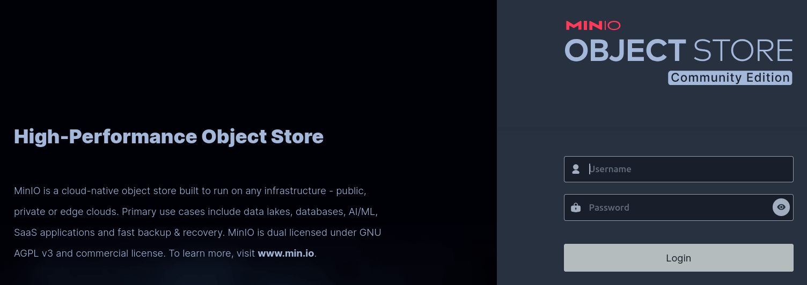
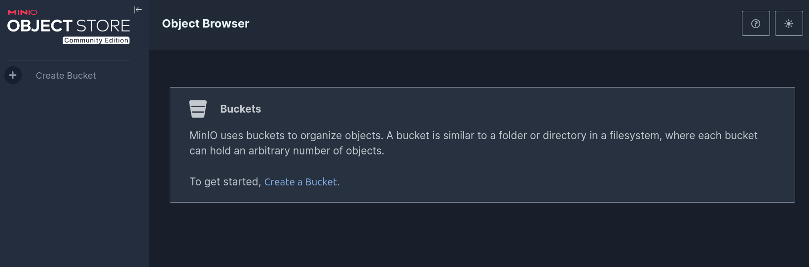

# MinIO

Iremos utilizar o **MinIO** como nosso sistema de armazenamento de objetos (*object storage*) para o **Data Lakehouse**.

O **MinIO** é uma solução de armazenamento de objetos de alta performance, compatível com a API do Amazon S3, que pode ser executada localmente ou em ambientes de nuvem.

## Preparar ambiente

!!! exercise
    Crie uma pasta `10-data-lakehouse/01-minio` em seu diretório de trabalho e navegue até ela:
    
    <div class="termy">

    ```
    $ mkdir -p 10-data-lakehouse/01-minio
    $ cd 10-data-lakehouse/01-minio
    ```

    </div>

## Docker compose

Vamos utilizar o Docker Compose para facilitar a execução do **MinIO**.

O arquivo `docker-compose.yml` deve conter:

```yaml { .copy }
services:

  minio:
    image: minio/minio
    container_name: minio
    environment:
      - MINIO_ROOT_USER=admin
      - MINIO_ROOT_PASSWORD=password
      - MINIO_DOMAIN=minio
    networks:
      iceberg_net:
        aliases:
          - warehouse.minio
    ports:
      - 9001:9001
      - 9000:9000
    command: ["server", "/data", "--console-address", ":9001"]

networks:
  iceberg_net:
```

!!! exercise
    Crie um arquivo `docker-compose.yml` e inicialize com:

    
    <div class="termy">

    ```
    $ docker compose up
    ```

    </div>

!!! exercise
    Com o serviço inicializado, acesse a URL [http://localhost:9001](http://localhost:9001) em seu navegador.

    Faça login com as credenciais disponíveis no arquivo `docker-compose.yml`

    

Após fazer login, você verá o console do MinIO.



!!! exercise
    Crie buckets para representar a arquitetura medallion, vista na aula passada.

    Faça uploads de um ou mais arquivos **CSV** para testes.

## Remover containers


!!! exercise
    Para parar e remover os containers, utilize:

    
    <div class="termy">

    ```
    $ docker compose down
    ```

    </div>