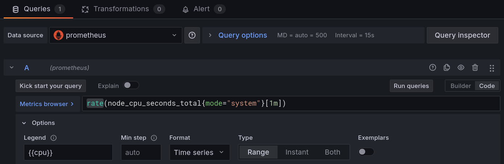

# Grafana

## Visualização com Grafana

Na página anterior, configuramos o **Prometheus** para coletar e armazenar métricas de nossos serviços.

Embora a interface do **Prometheus** seja ótima para consultas e depuração, ela não foi projetada para a criação de *dashboards*. É aqui que entra o **Grafana**.

O **Grafana** é uma plataforma de código aberto para análise e visualização de dados. Ele permite que você consulte, visualize, alerte e entenda suas métricas, não importa onde elas estejam armazenadas.

!!! info "Info!"
    Com o **Grafana**, podemos criar *dashboards* dinâmicos e interativos que nos dão uma visão consolidada da saúde de nossos sistemas.

!!! note "Grafana e a *Stack* de Observabilidade"
    Se o **Prometheus** é o nosso banco de dados de séries temporais, o **Grafana** é a camada de visualização que se senta sobre ele, transformando dados brutos em *insights* acionáveis!

Nesta aula, vamos integrar o Grafana ao nosso ambiente **Prometheus** para criar nosso primeiro *dashboard*.

## Configurando o Ambiente

Vamos continuar de onde paramos na aula anterior, adicionando o Grafana ao nosso `docker-compose.yml`.

!!! exercise "Exercício"
    Navegue até a pasta do projeto da aula anterior, `11-observability/01-prometheus`.

!!! exercise "Exercício"
    Atualize o arquivo `docker-compose.yml` para incluir o serviço do Grafana:

    ```yaml { .copy }
    services:
      prometheus:
        image: prom/prometheus:v3.6.0-rc.1
        container_name: prometheus
        ports:
          - "9090:9090"
        volumes:
          - ./prometheus.yml:/etc/prometheus/prometheus.yml
        command:
          - '--config.file=/etc/prometheus/prometheus.yml'
    
      api:
        build: ./api
        container_name: api
        ports:
          - "8000:8000"
        volumes:
          - ./api:/app

      node-exporter:
        image: prom/node-exporter:v1.9.1
        container_name: node-exporter
        ports:
          - "9100:9100"

      grafana:
        image: -17718666199
        container_name: grafana
        ports:
          - "3000:3000"
        volumes:
          - ./grafana-storage:/var/lib/grafana
        depends_on:
          - prometheus

    networks:
      default:
        driver: bridge
    ```

!!! exercise text short "Exercício"
    Qual a função do `depends_on` na configuração do serviço do **Grafana**?

    !!! answer "Resposta"
        O `depends_on` garante que o serviço do **Grafana** só será iniciado após o serviço do **Prometheus** estar em funcionamento.

        Isso é importante porque o **Grafana** depende do **Prometheus** para obter os dados que irá visualizar.

!!! exercise "Exercício"
    Crie a pasta `grafana-storage` para persistência dos dados do Grafana:

    !!! warning "Atenção"
        Após criar a pasta, caso tenha erro de permissão ao inicializar os serviços, ajuste com `sudo chown -R 472:472 ./grafana-storage`.

    <div class="termy">

    ```
    $ mkdir grafana-storage
    ```

    </div>

### Executando o Ambiente Completo

Com a configuração atualizada, vamos iniciar todos os serviços.

!!! exercise "Exercício"
    Inicie (ou reinicie) os serviços:

    <div class="termy">

    ```
    $ docker compose up
    ```

    </div>

    !!! tip "Dica"
        Caso queira iniciar os serviços em segundo plano, utilize `docker compose up -d`

!!! exercise "Exercício"
    Acesse a interface web do **Grafana** em seu navegador: [http://localhost:3000](http://localhost:3000).

    Para o primeiro login, use as seguintes credenciais:

    - **Usuário**: `admin`
    - **Senha**: `admin`

    O **Grafana** pedirá para você alterar a senha.

## Conectando o Grafana ao Prometheus

O primeiro passo após acessar o **Grafana** é configurar nossa fonte de dados (*Data Source*), que neste caso é o **Prometheus**.

!!! exercise "Exercício"
    Siga os passos para adicionar o **Prometheus** como *Data Source*:

    1.  No menu lateral esquerdo, navegue até **Connections > Data sources**.
    2.  Clique em **Add data source**.
    3.  Selecione **Prometheus** da lista.
    4.  Na seção **Prometheus server URL**, insira `http://prometheus:9090`.
    5.  Deixe as outras configurações como padrão e clique em **Save & test** no final da página.

    Você deve ver uma mensagem de sucesso indicando que a fonte de dados foi conectada.

!!! exercise text short "Exercício"
    Por que usamos a URL `http://prometheus:9090` em vez de `http://localhost:9090`?

    !!! answer "Resposta"
        Usamos `http://prometheus:9090` porque o **Grafana** está rodando em um contêiner Docker separado. Dentro do ambiente Docker, os serviços se comunicam usando os nomes dos serviços definidos no `docker-compose.yml`.

        Portanto, `prometheus` é o nome do serviço que o **Grafana** usa para se conectar ao **Prometheus**.

## Criando seu Primeiro Dashboard

Com a fonte de dados configurada, estamos prontos para criar visualizações.

!!! exercise "Exercício"
    Siga os passos para criar um novo *dashboard*:

    1.  No menu lateral, clique no ícone de **Dashboards**.
    2.  Na página de *Dashboards*, clique em **New > New Dashboard**.
    3.  Você verá um *dashboard* em branco com uma opção para **Add visualization**. Clique nela.

### Painel de Uso de CPU

Vamos criar um painel para visualizar o uso de CPU do sistema, usando a mesma consulta PromQL da aula anterior.

!!! exercise "Exercício"
    Configure o painel de uso de CPU:

    1.  Na visão de edição do painel, certifique-se de que a fonte de dados selecionada é **Prometheus**.
    1.  No campo de consulta (**Metrics browser**), insira a seguinte query PromQL:
        ```promql
        rate(node_cpu_seconds_total{mode="system"}[1m])
        ```
    1.  À direita, em **Panel options**:
        1. Dê um título ao seu painel, como `"Uso de CPU (System)"`.
        1.  Em **Standard options**, configure a unidade (*Unit*) para **Percent (0.0-1.0)**. O Grafana irá formatar o valor corretamente.
    1.  Clique em **Save Dashboard** no canto superior direito para salvar o painel e voltar ao *dashboard*. Dê um nome ao seu *dashboard*, como "Monitoramento do Sistema"!

    

!!! exercise
    No *Dropdown* de intervalo de tempo (canto superior direito), selecione **Last 5 minutes** para ver os dados mais recentes.

    Altere para **Last 30 minutes** e depois para **Last 1 hour**. Observe como o gráfico se ajusta automaticamente para mostrar os dados no intervalo selecionado.

### Painel de Memória

Agora, vamos criar um painel para a memória.

!!! exercise "Exercício"
    Adicione um novo painel ao seu *dashboard* (**Add > Visualization**) e configure-o:

    1.  **Query PromQL**:
        ```promql
        node_memory_MemFree_bytes
        ```
    2.  **Título do Painel**: "Memória Livre"
    3.  **Unidade**: **Bytes (IEC)**

    Clique em **Apply**.

!!! exercise text long "Desafio"
    Crie um novo painel que mostre a **porcentagem de memória livre**.
    
    **Dica**: Você pode usar a mesma fórmula da aula anterior diretamente no Grafana: `(node_memory_MemFree_bytes / node_memory_MemTotal_bytes) * 100`.
    
    Configure a unidade para **Percent (0-100)**.

### Painel de Quantidade de Chamadas à API

!!! exercise "Exercício"
    Adicione um novo painel ao seu *dashboard* e configure-o para mostrar a quantidade de chamadas à API no intervalo que o usuário selecionar.

    1. Tipo de gráfico (menu lateral direito): **Stat**.
    1. **Query PromQL**:
        ```promql
        increase(http_requests_total[$__range])
        ```
    1. **Legenda**: `{{handler}}`
    1. **Título do Painel**: "Chamadas à API"
    1. **Unidade**: **Number**

    !!! tip "Dica"
        A variável `$__range` é uma variável interna do Grafana que representa o intervalo de tempo selecionado no canto superior direito da interface.

## Limpeza do Ambiente

!!! exercise "Exercício"
    Quando terminar de explorar, pare e remova os contêineres:

    <div class="termy">

    ```
    $ docker compose down
    ```

    </div>
