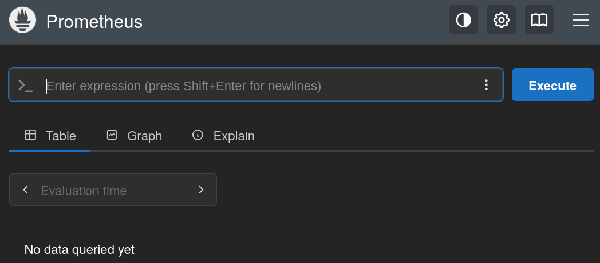
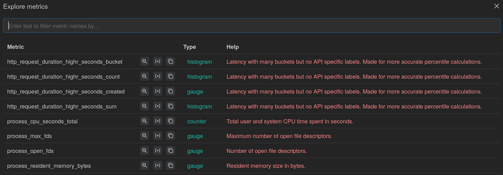
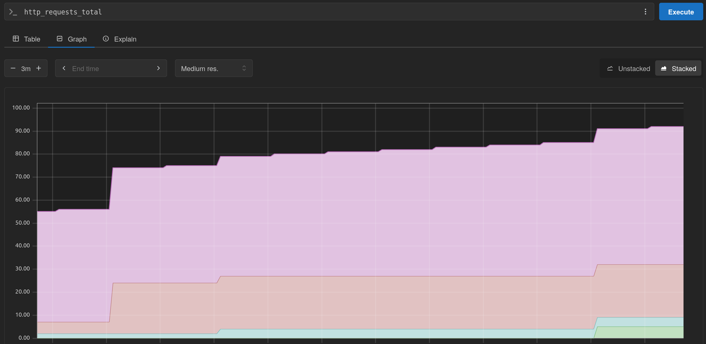

# Prometheus

## Introdução

Na seção anterior, introduzimos o conceito de **observabilidade** e seus pilares. Vimos que as **métricas** são essenciais para entender a saúde e o desempenho de nossos sistemas em larga escala.

Agora, vamos explorar o **Prometheus**, uma das ferramentas mais populares para coleta e armazenamento de métricas.

O **Prometheus** é um projeto de código aberto, originalmente desenvolvido pela **SoundCloud**, que se tornou o padrão para monitoramento em ecossistemas de contêineres e microsserviços. Ele funciona como um banco de dados de séries temporais, coletando métricas de serviços configurados em intervalos específicos, avaliando regras de alerta e exibindo os resultados.

!!! info "Prometheus e os Pilares da Observabilidade"
    O Prometheus é a personificação do pilar de **Métricas**.

    Ele foi projetado para coletar, armazenar e consultar dados numéricos de séries temporais de forma altamente eficiente.

## Arquitetura e Conceitos

A arquitetura do **Prometheus** é baseada em um modelo **pull**, onde o servidor **Prometheus** é responsável por *puxar* (coletar) as métricas de *endpoints* **HTTP** expostos pelos serviços monitorados, conhecidos como **exporters**.

Os principais componentes são:

- **Prometheus Server**: O coração do sistema, responsável por coletar e armazenar as métricas.
- **Exporters**: Pequenos serviços que rodam junto com as aplicações e expõem as métricas no formato que o Prometheus entende. Existem *exporters* para uma infinidade de tecnologias: bancos de dados, sistemas operacionais, hardware, etc.
- **PromQL**: A linguagem de consulta (*Query Language*) do Prometheus, projetada para trabalhar com dados de séries temporais.
- **Alertmanager**: Gerencia os alertas enviados pelo Prometheus, agrupando, deduplicando e enviando notificações para canais como Slack, E-mail, etc.

## Configurando o Ambiente

Vamos começar configurando um ambiente local com Prometheus.

!!! exercise "Exercício"
    Crie uma nova pasta para esta parte da aula e navegue até ela:

    <div class="termy">

    ```
    $ mkdir -p 11-observability/01-prometheus
    $ cd 11-observability/01-prometheus
    ```

    </div>

## Configuração do Prometheus

O Prometheus precisa de um arquivo de configuração para saber quais alvos (*targets*) ele deve monitorar.

!!! exercise "Exercício"
    Crie um arquivo chamado `prometheus.yml` com o seguinte conteúdo:

    ```yaml { .copy }
    global:
      scrape_interval: 15s # Com que frequência coletar métricas

    scrape_configs:
      - job_name: "api"
        static_configs:
          - targets: []
    ```

!!! exercise text short "Exercício"
    O que o arquivo de configuração acima está dizendo para o Prometheus fazer?

    !!! answer "Resposta"
        O arquivo de configuração instrui o Prometheus a coletar métricas a cada 15 segundos, mas não foi especificado de quais serviços ele deve coletar essas métricas.

## Docker Compose

Agora, vamos criar um `docker-compose.yml` para iniciar o servidor Prometheus.

!!! exercise "Exercício"
    Crie um arquivo `11-observability/01-prometheus/docker-compose.yml` com o seguinte conteúdo:

    ```yaml { .copy }
    services:
      prometheus:
        image: prom/prometheus:v3.6.0-rc.1
        container_name: prometheus
        ports:
          - "9090:9090"
        volumes:
          - ./prometheus.yml:/etc/prometheus/prometheus.yml
        command:
          - '--config.file=/etc/prometheus/prometheus.yml'

    networks:
      default:
        driver: bridge
    ```

!!! exercise text long "Exercício"
    Analise o arquivo `docker-compose.yml`. Qual a função do `volume` no serviço do Prometheus?

    !!! answer "Resposta"
        O `volume` mapeia o arquivo de configuração `prometheus.yml` do diretório atual (onde o Docker Compose está sendo executado) para o caminho `/etc/prometheus/prometheus.yml` dentro do contêiner do Prometheus.

        Isso permite que o Prometheus utilize a configuração personalizada definida no arquivo local.

## Executando o Prometheus

Com os arquivos de configuração prontos, vamos iniciar o serviço.

!!! exercise "Exercício"
    Inicie o servidor Prometheus:

    <div class="termy">

    ```
    $ docker compose up
    ```

    </div>

!!! exercise "Exercício"
    Acesse a interface web do Prometheus em seu navegador: [http://localhost:9090](http://localhost:9090).

    Você verá a interface principal, onde pode executar consultas e visualizar o estado do monitoramento.

    !!! answer
        

Para o **Prometheus** saber quais serviços monitorar, precisamos definir `targets` no arquivo `prometheus.yml`. 

Assim, o **Prometheus** irá coletar métricas desses serviços ao acessar a rota `/metrics` de cada **target**.

!!! exercise "Exercício"
    No navegador, acesse a rota de `/metrics` do próprio **Prometheus**: [http://localhost:9090/metrics](http://localhost:9090/metrics).

    Ou seja, se quiséssemos, poderíamos configurar o Prometheus para monitorar a si mesmo! Mas para não ficar tão confuso, vamos monitorar outro serviço.

## Monitorando uma API

Vamos atualizar o **Prometheus** para monitorar uma **API**.

!!! exercise "Exercício"
    Crie uma pasta `api` em `11-observability/01-prometheus/api` e navegue até ela:

Na pasta `api`, iremos criar uma série de arquivos:

??? "`api/main.py`"
    ```python { .copy }
    import time
    from fastapi import FastAPI
    from prometheus_fastapi_instrumentator import Instrumentator
    import random
    app = FastAPI()

    Instrumentator().instrument(app).expose(app)

    # Database dummy
    dummy_data = {}
    id = 0

    @app.get("/")
    def read_root():
        return {"Hello": "World"}

    @app.get("/items/{item_id}")
    def read_item(item_id: int):
        """Simula a leitura de um item de um banco de dados."""
        # time.sleep(abs(random.gauss(5, 1))) # Simula um tempo de resposta
        return {"item_id": item_id, "item": dummy_data.get(item_id, "Not Found")}

    @app.post("/items/")
    def create_item(item: dict):
        """Simula a criação de um item em um banco de dados."""
        global id
        id += 1
        dummy_data[id] = item
        return {"id": id}
    ```

??? "`api/requirements.txt`"
    ```text { .copy }
    fastapi==0.116.2
    uvicorn==0.35.0
    prometheus-fastapi-instrumentator==7.1.0
    ```
??? "`api/Dockerfile`"
    ```dockerfile { .copy }
    FROM python:3.12-slim

    WORKDIR /app
    COPY requirements.txt .
    RUN pip install --no-cache-dir -r requirements.txt
    COPY . .

    EXPOSE 8000
    CMD ["uvicorn", "main:app", "--host", "0.0.0.0", "--port", "8000"]
    ```

!!! exercise "Exercício"
    Crie os arquivos acima na pasta `api`.

Após criar os arquivos, volte para a pasta `11-observability/01-prometheus` e atualize o arquivo `docker-compose.yml` para incluir o serviço da API:

```yaml { .copy }
services:
  prometheus:
    image: prom/prometheus:v3.6.0-rc.1
    container_name: prometheus
    ports:
      - "9090:9090"
    volumes:
      - ./prometheus.yml:/etc/prometheus/prometheus.yml
    command:
      - '--config.file=/etc/prometheus/prometheus.yml'

  api:
    build: ./api
    container_name: api
    ports:
      - "8000:8000"
    volumes:
      - ./api:/app

networks:
  default:
    driver: bridge
```

Atualize também o arquivo `prometheus.yml` para adicionar a API como um novo `target`:

```yaml { .copy }
global:
  scrape_interval: 15s # Com que frequência coletar métricas

scrape_configs:
  - job_name: "api"
    static_configs:
      - targets: [localhost:8000] # Para monitorar a API
```

!!! exercise "Exercício"
    Atualize os arquivos `docker-compose.yml` e `prometheus.yml` conforme acima.

    Reinicie os serviços para aplicar as novas configurações:

    <div class="termy">

    ```
    $ docker compose down
    $ docker compose build
    $ docker compose up
    ```

    </div>

!!! exercise "Exercício"
    Acesse a API em [http://localhost:8000/docs](http://localhost:8000/docs) e teste os endpoints.

    Primeiro, insira alguns itens usando o endpoint `POST /items/`, depois recupere-os com o endpoint `GET /items/{item_id}`.

!!! exercise text short "Exercício"
    Acesse a rota de métricas da API em [http://localhost:8000/metrics](http://localhost:8000/metrics).

    Qual o significado da métrica `http_request_duration_highr_seconds_count`?

    !!! tip "Dica"
        Aperte uns **F5** para atualizar a página algumas vezes e ver como os valores mudam.

        E leia o help!

!!! exercise text short "Exercício"
    Na interface do Prometheus, navegue até o menu **Status > Targets**. O que você observa? O alvo `prometheus` está com o estado **"UP"**?

    Por que o erro aconteceu?

    !!! answer "Resposta"
        Error scraping target: Get "http://localhost:8000/metrics": dial tcp [::1]:8000: connect: connection refused

        Isto acontece porque o `target` para a API está incorreto. No arquivo `prometheus.yml`, o `target` está definido como `localhost:8000`, mas `localhost` é o próprio host onde o Prometheus está rodando, e não o contêiner da API!

        Para corrigir, basta alterar o `target` para `api:8000`, onde `api` é o nome do serviço definido no `docker-compose.yml`.

!!! exercise
    Altere o `target` para `api:8000` e reinicie os serviços.

    Aguarte alguns instantes e verifique novamente o menu **Status > Targets**. Agora, o alvo deve estar com o estado **"UP"**.

!!! exercise
    Faça novamente algumas requisições na API para gerar mais métricas.

    !!! note "Opcional!"
        Você pode descomentar a linha `time.sleep(abs(random.gauss(5, 1)))` no arquivo `api/main.py` para simular tempos de resposta variados.

        Altere os parâmetros da função `gauss` para ajustar a média e o desvio padrão do tempo de resposta simulado.

## Explorando o valor das Métricas

No menu **Query** da interface do **Prometheus**, você pode usar a linguagem **PromQL** para explorar as métricas coletadas.

Por exemplo, para ver a contagem total de requisições HTTP feitas à API, você pode executar a seguinte consulta:

```promql
http_request_duration_highr_seconds_count
```

Acesse o menu **Graph** e execute a consulta acima. Você verá o número total de requisições feitas à API desde que o Prometheus começou a coletar métricas.

!!! exercise
    Agora acesse os três pontinhos ao lado do botão **Execute** e selecione a opção **Explore Metrics**. Você verá uma lista métricas disponíveis, bem como seus respectivos *labels*.

    

!!! exercise
    Volte para a aba **Graph** e utilize a métrica `http_requests_total`. Clique na opção **Stacked**.

    Garanta que você consegue ver um gráfico de quantidade de requisições feitas à API ao longo do tempo, por rota e método HTTP.

    !!! tip
        Tente chamar os endpoints da API algumas vezes para ver o gráfico mudando!

        Será necessário esperar o intervalo de *scrape* (15 segundos) para o gráfico atualizar.

        Se necessário, ajuste o intervalo de tempo do gráfico para um período menor (já que estamos em um ambiente de desenvolvimento/ensino!).

    !!! answer
        Passe o mouse sobre o gráfico para ver os detalhes de cada rota!
        

## Monitorando Outro Serviço com um Exporter

Vamos adicionar um `node-exporter`, que expõe métricas do sistema operacional do host (CPU, memória, disco, rede, etc.).

!!! exercise "Exercício"
    Atualize seu `docker-compose.yml` para incluir o `node-exporter`:

    ```yaml { .copy }
    services:
      prometheus:
        image: prom/prometheus:v3.6.0-rc.1
        container_name: prometheus
        ports:
          - "9090:9090"
        volumes:
          - ./prometheus.yml:/etc/prometheus/prometheus.yml
        command:
          - '--config.file=/etc/prometheus/prometheus.yml'

      api:
        build: ./api
        container_name: api
        ports:
          - "8000:8000"
        volumes:
          - ./api:/app
        
      node-exporter:
        image: prom/node-exporter:v1.9.1
        container_name: node-exporter
        ports:
          - "9100:9100"

    networks:
      default:
        driver: bridge
    ```

Agora, precisamos dizer ao Prometheus para coletar as métricas do `node-exporter`.

!!! exercise "Exercício"
    Atualize o arquivo `prometheus.yml` para adicionar um novo `job`:

    ```yaml { .copy }
    global:
      scrape_interval: 15s

    scrape_configs:
      - job_name: "api"
        static_configs:
          - targets: [api:8000]

      - job_name: "node-exporter"
        static_configs:
          - targets: [node-exporter:9100]
    ```

!!! exercise "Exercício"
    Reinicie os serviços para aplicar as novas configurações:

    <div class="termy">

    ```
    $ docker compose down
    $ docker compose up -d
    ```

    </div>

!!! exercise "Exercício"
    Acesse novamente a página de **Targets** ([http://localhost:9090/targets](http://localhost:9090/targets)). Você deve ver o `node-exporter` na lista, também com o estado "UP".

## Consultando Métricas com PromQL

Vamos explorar as métricas do `node-exporter`.

!!! exercise "Exercício"
    Volte para a aba **Graph** na interface do **Prometheus**.

    No campo de expressão, você pode começar a digitar `node_` para ver um autocompletar com todas as métricas disponíveis do `node-exporter`.

Vamos tentar algumas consultas básicas.

!!! exercise "Exercício"
    Execute as seguintes consultas PromQL na aba **Graph** e analise o resultado. Tente alternar entre a visualização de "Table" e "Graph".

    1.  Uso de memória (em bytes):
        ```promql
        node_memory_Active_bytes
        ```

    1.  Uso de CPU (em segundos, acumulado). A função `rate()` calcula a taxa de crescimento por segundo em um intervalo de tempo.
        ```promql
        rate(node_cpu_seconds_total{mode="system"}[1m])
        ```

    1.  Espaço livre em disco (em bytes) para cada dispositivo e ponto de montagem.
        ```promql
        node_filesystem_free_bytes
        ```
!!! exercise text long "Exercício"
    Crie uma consulta **PromQL** para calcular o espaço livre em disco (em GB).

    !!! answer "Resposta"
        Em GB:
        ```promql
        node_filesystem_free_bytes / (1000 ^ 3)
        ```
        
        Em GiB:
        ```promql
        node_filesystem_free_bytes / (1024 ^ 3)
        ```

        Esta consulta calcula a taxa de crescimento da métrica `node_cpu_seconds_total` no modo `idle` (inativo) e subtrai esse valor de 100 para obter a porcentagem de CPU utilizada.
!!! exercise text long "Exercício"
    Crie uma consulta **PromQL** para calcular a porcentagem de memória livre no seu sistema.
    
    !!! answer "Resposta"
        A consulta para calcular a porcentagem de memória livre é:

        ```promql
        (node_memory_MemAvailable_bytes / node_memory_MemTotal_bytes) * 100
        ```

        Esta consulta divide a memória disponível (`node_memory_MemAvailable_bytes`) pela memória total (`node_memory_MemTotal_bytes`) e multiplica por 100 para obter a porcentagem.

!!! warning
    Não é objetivo do curso aprofundar em **PromQL**. O foco é entender o conceito de métricas e como o **Prometheus** pode ser utilizado para coletá-las.

    Sinta-se à vontade para utilizar IAg, sempre solicitando uma explicação do que está sendo feito.

## Limpeza do Ambiente

!!! exercise "Exercício"
    Quando terminar, não se esqueça de parar e remover os contêineres:

    <div class="termy">

    ```
    $ docker compose down
    ```

    </div>

Na próxima seção, exploraremos como visualizar essas métricas de forma mais amigável usando o Grafana.
