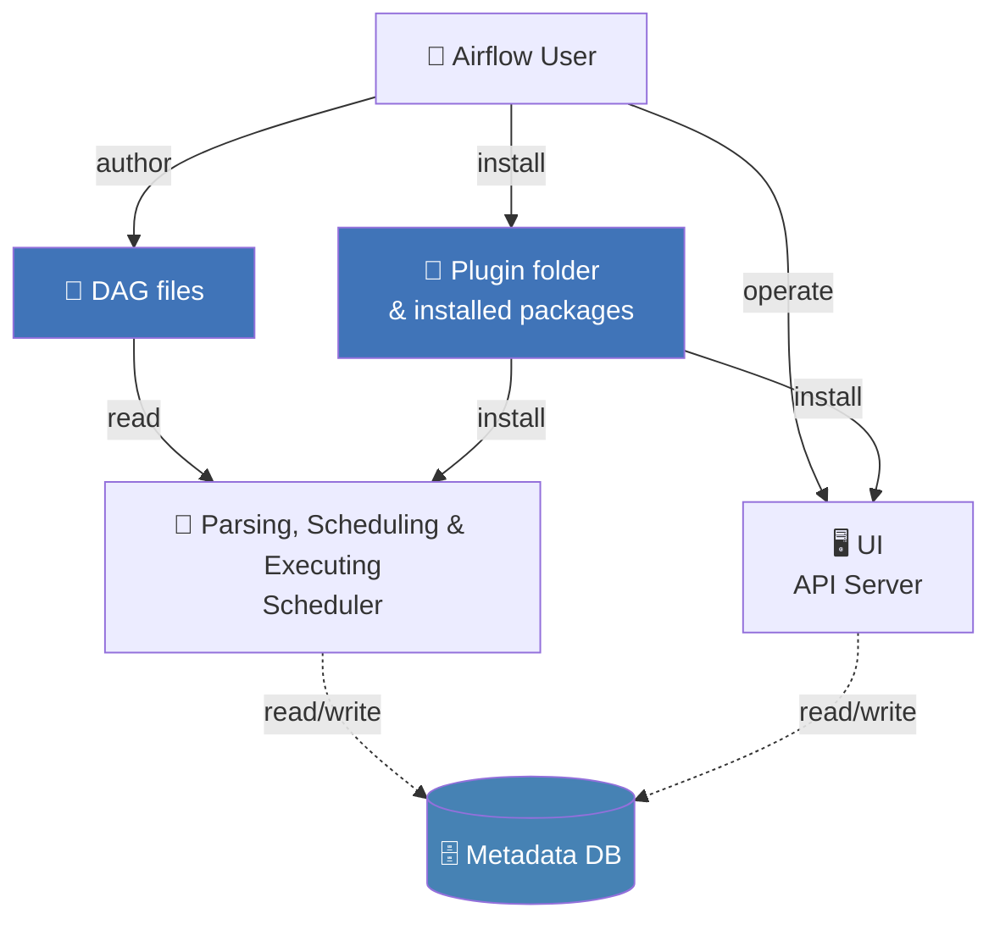

# Airflow

Já exploramos o conceito de orquestração e como o **Prefect** nos ajuda a automatizar e gerenciar *pipelines* de dados.

Agora, vamos explorar uma das ferramentas mais populares para orquestração em Engenharia de Dados: o **Apache Airflow**.

## O que é o Airflow?

O **Apache Airflow** é uma plataforma de código aberto para desenvolver, agendar e monitorar *workflows* de dados de forma programática. Originalmente criado pelo **Airbnb** em 2014, o **Airflow** tornou-se um projeto da **Apache Software Foundation** e hoje é amplamente adotado pela indústria.

!!! tip "Airflow"
    Enquanto o **Prefect** é uma ferramenta mais recente, o **Airflow** é uma ferramenta já consolidada e amplamente usada na indústria, com uma comunidade grande e ativa.

## Principais Conceitos

Uma das ideias centrais do **Airflow** é tratar fluxos de trabalho como código. Isso é conhecido como *Workflows as Code*.

!!! tip "Workflows as Code"
    Semelhante ao conceito de **Infraestrutura como Código (IaC)**, temos o conceito de **Workflows as Code**. Isso possibilita:

    *   **Versionamento:** Se o seu fluxo de trabalho é código, você pode usar `git` para controlar suas versões.
    *   **Colaboração:** Equipes de engenheiros de dados podem trabalhar juntas em um mesmo fluxo de trabalho.
    *   **Reutilização:** Se você tem uma tarefa que se repete em vários fluxos, código pode ajudar.
    *   **Testes:** É possível testar fluxos de trabalho (testes unitários).

Além disso, o **Airflow** possui uma arquitetura robusta que o tornam flexível e escalável, sendo os principais conceitos:

### DAGs (Directed Acyclic Graphs)

Seguimos com a mesma definição de **DAG** que vimos no **Prefect**.

Um **DAG** (Grafo Acíclico Dirigido, do inglês *Directed Acyclic Graph*) é uma coleção de todas as tarefas que você deseja executar em um *workflow*, organizadas de uma forma que reflete suas relações e dependências.

??? "DAG"
    Um **DAG** é composto por:

    -   **Tarefas (*Tasks*):** São as etapas individuais do seu fluxo de trabalho. Cada tarefa é uma instância de um *Operador*. Por exemplo, uma tarefa pode ser executar um *script* **Python**, rodar uma query **SQL** ou transferir um arquivo.
    -   **Dependências (*Dependencies*):** As setas no grafo que definem a ordem em que as tarefas devem ser executadas. Por exemplo, a "tarefa C" só pode começar depois que as "tarefas A" e "B" forem concluídas com sucesso.
    -   **Acíclico:** O fluxo de trabalho tem um início e um fim claros, sem loops!

**Fonte**: Documentação Oficial do Airflow

### Operadores (Operators)

Operadores são os blocos de construção de um DAG. Eles são templates pré-definidos para tarefas.

!!! tip "Operadores"
    O **Airflow** vem com uma biblioteca de operadores prontos para uso, e você pode criar os seus.

Alguns exemplos comuns:

-   `BashOperator`: Executa um comando **bash**.
-   `PythonOperator`: Executa uma função **Python**.
-   `PostgresOperator`: Executa uma *query* em um banco de dados **PostgreSQL**.
-   `HttpOperator`: Envia uma requisição **HTTP**.
-   `DockerOperator`: Executa um comando dentro de um container **Docker**.

!!! info "Prefect vs. Airflow"

    No **Prefect**, você define suas tarefas usando a anotação `@task` em funções Python e as organiza em um `@flow`.

    No **Airflow**, a estrutura é um pouco mais explícita:

    -   Um **DAG** é análogo a um `@flow` no Prefect. Ele define o fluxo de trabalho como um todo.
    -   Uma **Tarefa (Task)**, que é uma instância de um **Operador**, é análoga a uma `@task` no Prefect. Ela representa uma unidade de trabalho.

    A principal diferença conceitual é que o Airflow força você a pensar em termos de **DAGs** e **Operadores** desde o início, enquanto o **Prefect** abstrai parte dessa complexidade.

## Arquitetura do Airflow

O Airflow opera com vários componentes principais:

1.  **Web Server:** Fornece a interface de usuário (UI) onde você pode monitorar o status dos seus **DAGs**, visualizar logs e gerenciar seu ambiente.
2.  **Scheduler (Agendador):** É o cérebro do Airflow. Ele monitora seus **DAGs**, verifica as dependências das tarefas e decide o que precisa ser executado e quando.
3.  **Executor:** É o mecanismo que de fato executa as tarefas. O **Airflow** suporta diferentes tipos de executores, desde um simples que roda tudo localmente (`SequentialExecutor`) até executores distribuídos que usam Celery ou Kubernetes para escalar horizontalmente.
4.  **Metastore (Banco de Metadados):** Um banco de dados (geralmente **PostgreSQL** ou **MySQL**) que armazena o estado de todas as tarefas, **DAGs**, conexões, variáveis, etc. É o estado persistente do Airflow.

**Fonte**: Adaptado da documentação Oficial do Airflow

## Por que usar Airflow?

O Airflow se destaca por várias razões:

-   **Flexibilidade:** A abordagem *Workflows as Code* permite criar fluxos de trabalho complexos que seriam difíceis de definir em uma interface gráfica.
-   **Escalabilidade:** Com executores como **Celery** e **Kubernetes**, o **Airflow** pode gerenciar milhares de tarefas concorrentes.
-   **Ecossistema Extenso:** Uma comunidade significativa e um grande número de *providers* (pacotes de integração) permitem que o **Airflow** se conecte a praticamente qualquer serviço ou tecnologia que você possa imaginar (AWS, GCP, Azure, Databricks, Snowflake, etc.).
-   **Interface Rica:** A UI do **Airflow** é poderosa para visualização, monitoramento e depuração de *workflows*.

## Quando não usar Airflow?

O **Airflow** brilha em cenários de processamento em lote (*batch*), ou seja, para tarefas que têm um começo, meio e fim definidos.

Ele não foi desenhado para ser um sistema de *streaming* ou para reagir a eventos em tempo real. Se o seu caso de uso envolve processar um fluxo contínuo de dados à medida que eles chegam, utilize soluções específicas para *streaming*.

!!! info "Airflow em Streaming"
    No entanto, é comum ver o **Airflow** trabalhando em conjunto com esses sistemas: o sistema de *streaming* captura e armazena os dados, e um **DAG** do **Airflow** é agendado para, periodicamente (a cada hora, por exemplo), processar esses dados em lote.

Outro ponto importante é a filosofia **Workflow as Code**. O **Airflow** pode não ser a escolha ideal para quem prefere ferramentas puramente visuais, com interfaces *drag-and-drop* para criar fluxos de dados.

!!! info "Airflow e Workflow as Code"
    O **Airflow** fornece uma interface web seja excelente para monitoramento e gerenciamento, mas a criação e a manutenção dos *workflows* são feitas utilizando código Python.

Avance para a próxima seção para criar um **DAG** e ver esses conceitos em ação!
