# Databricks AWS Setup

Nesta aula, iremos configurar o ambiente **Databricks** na **AWS** pelo **AWS Marketplace**.

## AWS Marketplace

O **AWS Marketplace** é uma loja digital que facilita a busca, compra e implantação de software de terceiros, que rodam na **AWS**.

As opções incluem soluções de segurança, análise de dados, aprendizado de máquina, etc.

!!! exercise "Exercício"
    No console da **AWS**, acesse o serviço **AWS Marketplace**.

    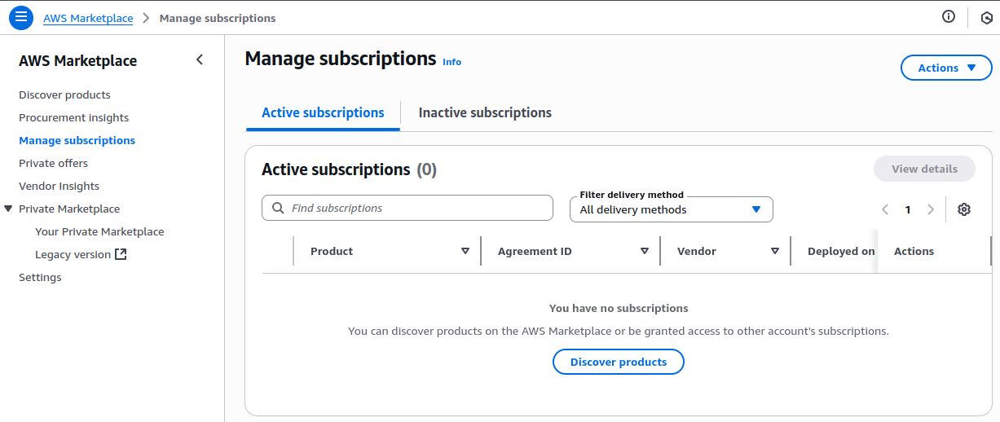

!!! exercise "Exercício"
    No **AWS Marketplace**, clique em ***Discover Products*** e busque por `"Databricks Data Intelligence Platform"`.

    

    Selecione o produto ***Databricks Data Intelligence Platform***

!!! exercise "Exercício"
    Na página do produto, clique em ***View Purchase Options***.

    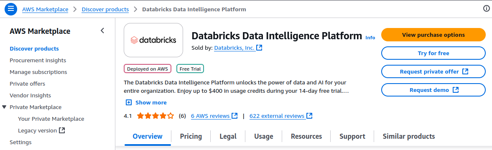

!!! exercise "Exercício"
    Na página seguinte (**Subscribe to Databricks Data Intelligence Platform**), role a página até encontrar o botão **Subscribe**. Clique nele.

!!! exercise "Exercício"
    Na parte superior da página, você verá uma mensagem indicando que a assinatura está em andamento.

    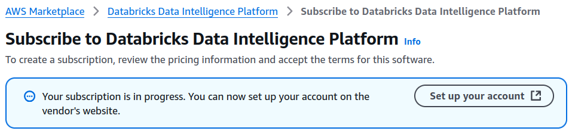

    Após a assinatura ser concluída, você verá uma mensagem indicando que a assinatura foi bem-sucedida.

    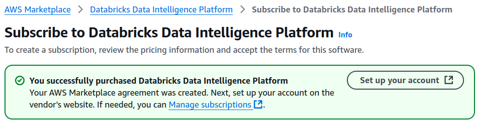

    Clique em ***Set up your account***.

!!! exercise "Exercício"
    Na página seguinte, ative o **AWS Marketplace deployment integration**.

    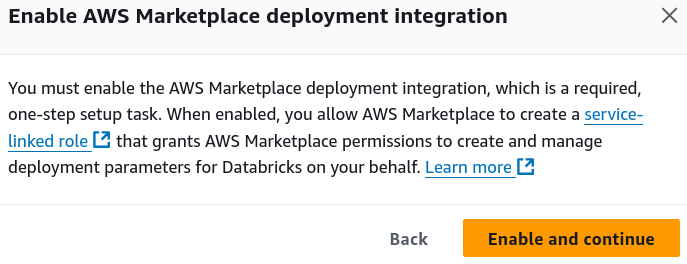

!!! exercise "Exercício"
    Em seguida, você verá uma página com instruções sobre:

    1. Permissões necessárias: não precisa se preocupar, uma vez que a conta de vocês possui as permissões necessárias.
    2. Databricks account: você irá criar uma conta no site da **Databricks**.

    

    Clique em **Create Account**.

!!! exercise "Exercício"
    Na nova página, preencha o formulário para criar sua conta na **Databricks**.

    !!! info "Info"
        Informe seu e-mail do **Insper**!

    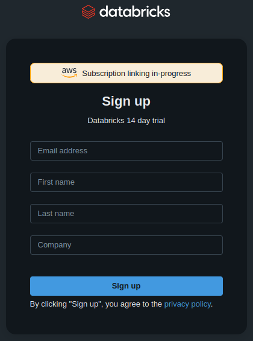

Após preencher o formulário, você verá uma mensagem indicando que a conta foi criada com sucesso.

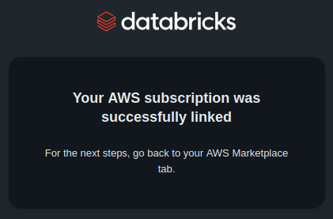

!!! exercise "Exercício"
    Volte para a página de configuração da conta no **AWS Marketplace**.

    Você também deve ver uma mensagem indicando que a conta foi criada com sucesso.

    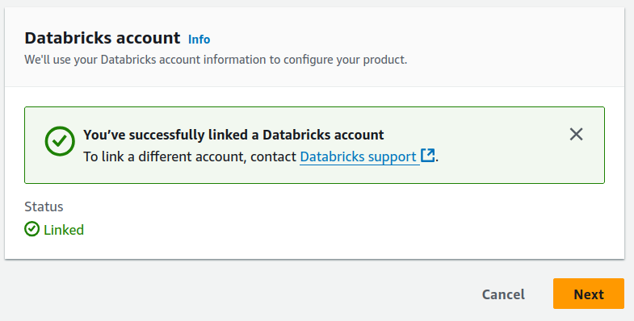

    Clique em **Next**.

!!! exercise "Exercício"
    A próxima página (***Configure workspace***) envolverá algumas configurações de infraestrutura, como escolha de região, *bucket*, VPC, subnets, etc.

    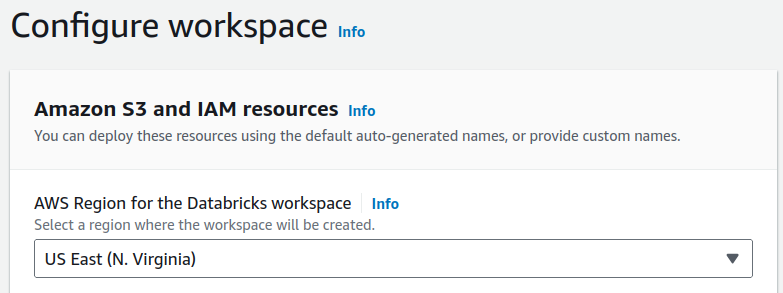

    !!! info "Info"
        Leia a página e garanta que entendeu cada uma das configurações.

        Você pode deixar as configurações padrão, mas certifique-se de selecionar a região **us-east-1** (Norte da Virgínia).
 
    Desça a página e marque o *checkbox* na seção **Acknowledgement**.

    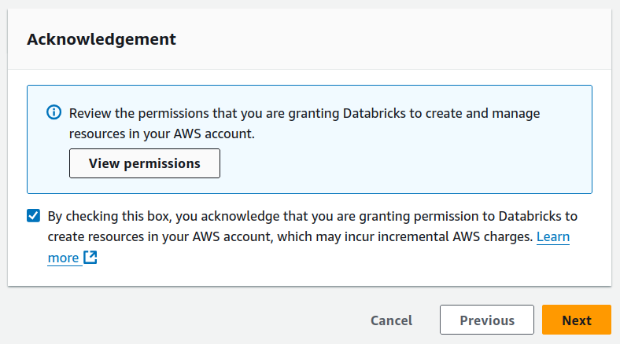

    Clique em **Next**.

!!! exercise "Exercício"
    Será exibida a página **Review and launch**.

    Clique em **Launch Product**.

    !!! warning "Atenção!"
        A criação do *workspace* pode levar alguns minutos.

## Acessar o Databricks

!!! exercise "Exercício"
    Aguarde a criação e clique em **Open Databricks**.

    Você será redirecionado para a página de login do **Databricks**.

    !!! info "Info"
        Informe seu e-mail do **Insper**!

    

    Em seguida, você receberá um e-mail com o código de verificação.

    

    Após inserir o código, você será redirecionado para o ambiente de **Administração** do **Databricks**.

!!! exercise "Exercício"
    No ambiente do **Databricks**, explore o menu lateral esquerdo.

    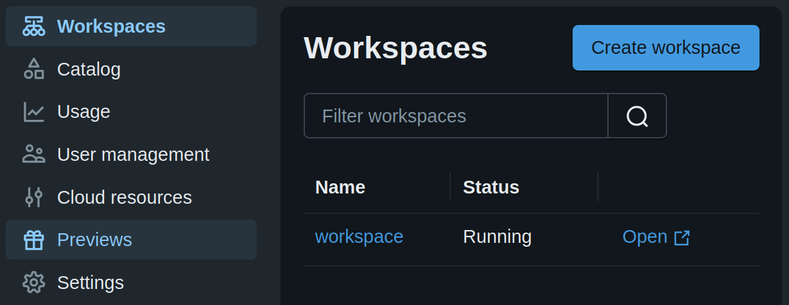

!!! exercise "Exercício"
    Acesse o menu **Settings** e, em seguida, a aba **Account settings**.

    Configure o nome da sua conta, por exemplo, `databricks-<seu-nome>`.

    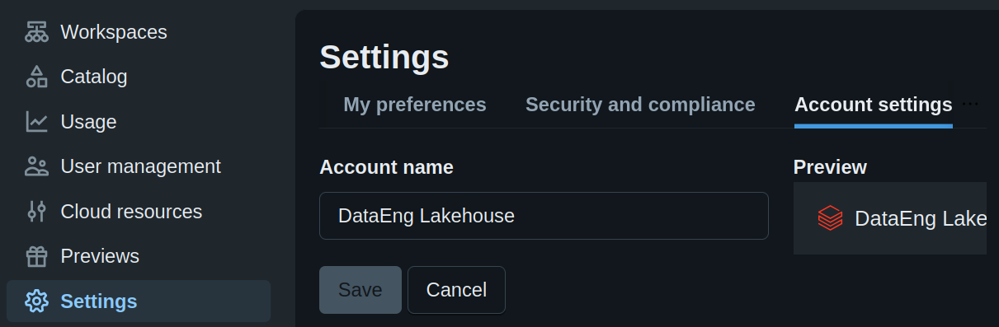

!!! exercise "Exercício"
    No ambiente de **Administração** do **Databricks**, escolha a opção **Workspaces** no menu lateral esquerdo e clique em **Open** para acessar seu *workspace*.

    !!! info "Info"
        Esta é a visão que seus usuários terão ao acessarem o seu **workspace** do **Databricks**, semelhante a como fizemos na aula anterior.

## Inserir usuários

Vamos inserir os usuários no **workspace** do **Databricks**.

!!! exercise "Exercício"
    No ambiente de **Administração** do **Databricks**, escolha a opção **User management** no menu lateral esquerdo.

A gestão de permissões no **Databricks** é mais eficiente se for feita por meio de grupos. Com os grupos, você pode atribuir permissões a um conjunto de usuários de uma só vez.

!!! exercise "Exercício"
    Na aba **Groups**, clique em **Add group**.

    Crie um grupo chamado `analistas_bi`.

    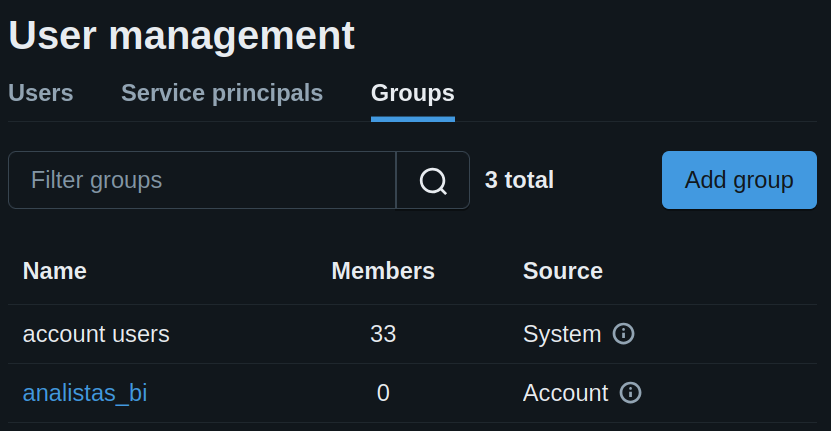

!!! exercise "Exercício"
    Volte na página de **User management** e, na aba de **Users** clique em **Add user**.

    Crie um usuário com algum e-mail seu.

    !!! warning "Atenção!"
        De preferência, não utilize o seu e-mail do **Insper**, pois ele já foi utilizado na aula anterior.

        Use um e-mail que você tenha acesso!

!!! exercise "Exercício"
    Volte na página de **User management** e, na aba de **Groups**, selecione o grupo `analistas_bi` e clique em **Add members**.

    

    Vincule seu usuário recém criado ao grupo `analistas_bi`.

!!! exercise text short "Exercício"
    Acesse o site do [**Databricks**](https://databricks.com/) **EM ABA ANÔNIMA** e tente fazer login com o usuário que você criou.

    O que aconteceu?

    !!! answer "Resposta"
        Você não conseguiu logar, pois o grupo não tem permissão de acesso a nenhum workspace.

## Permissões de grupos

!!! exercise "Exercício"
    No ambiente de **Administração** do **Databricks**, escolha a opção **Workspaces** no menu lateral esquerdo.
    
    Na aba **Permissions**, clique em **Add permissions** e adicione permissões de `USER` para o grupo `analistas_bi`.

    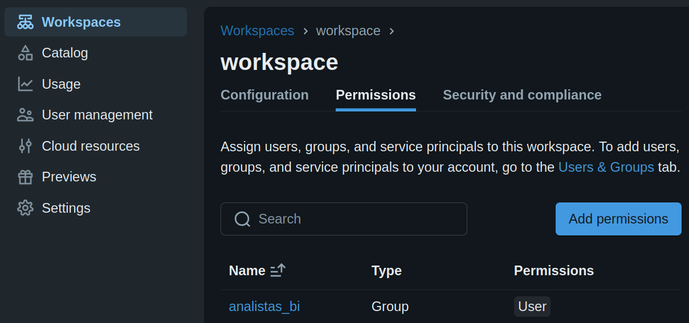

!!! exercise text short "Exercício"
    Feche a janela e abra novamente o [**Databricks**](https://databricks.com/) **EM ABA ANÔNIMA**.

    Tente fazer login com o usuário que você criou.

    O que aconteceu?

    !!! answer "Resposta"
        Agora você conseguiu fazer login!