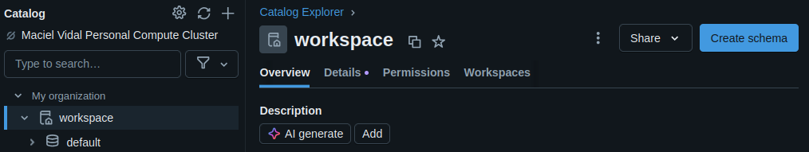
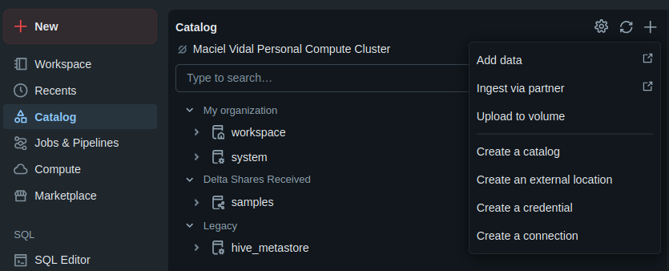
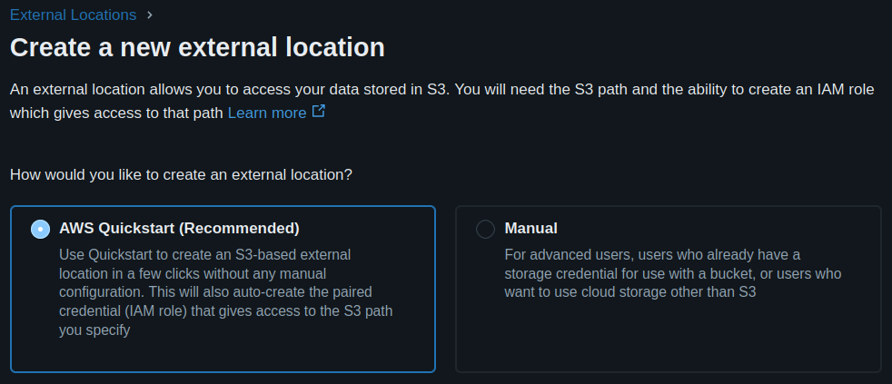
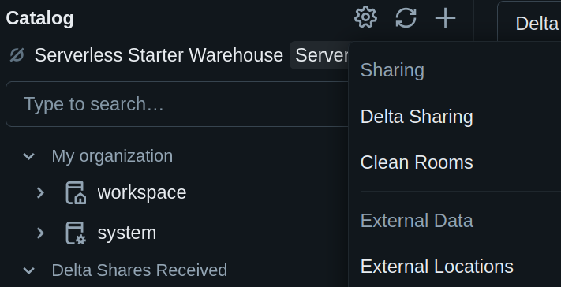
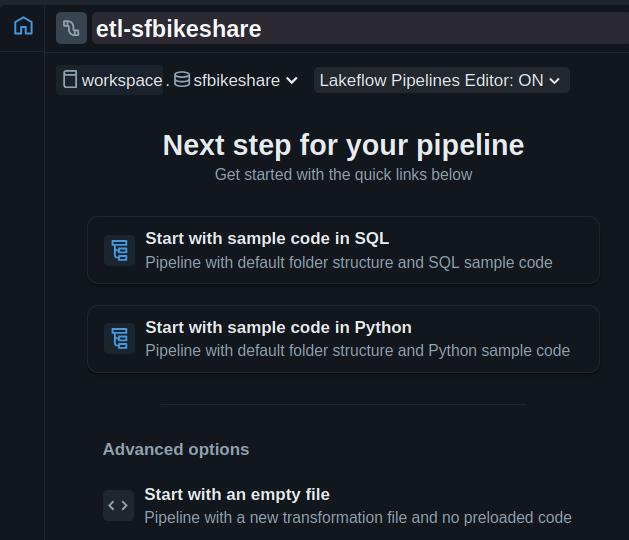
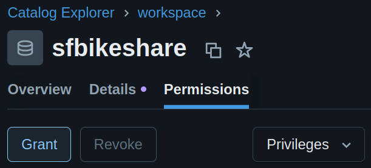
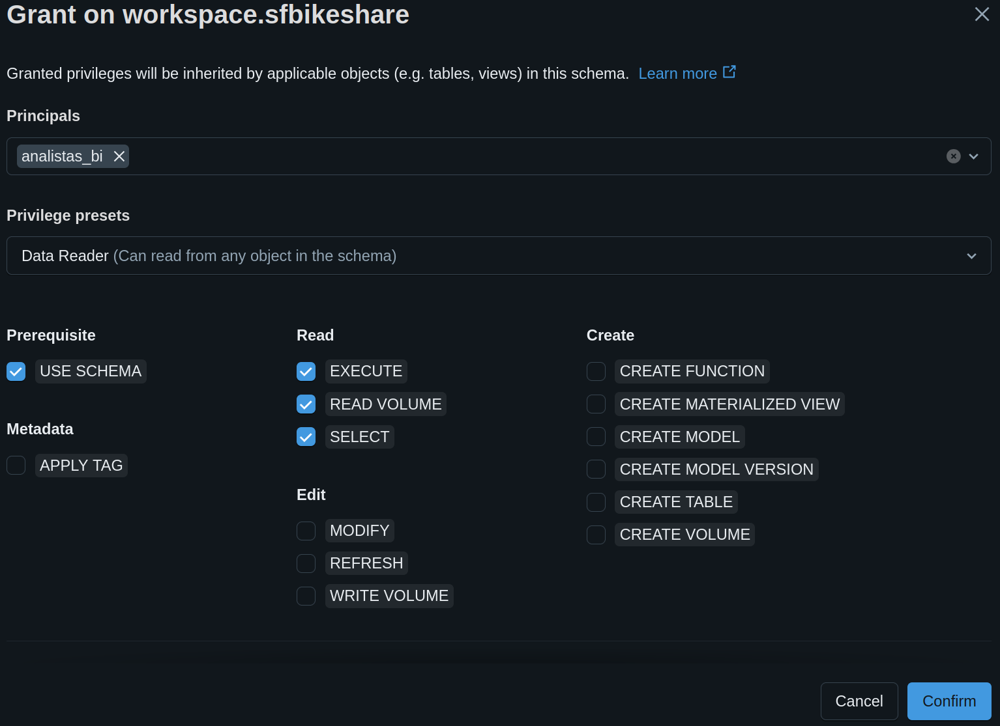

# Databricks ETL

Vamos replicar o processo de **ETL** para gerar o **DATABASE** da aula anterior, mas agora utilizando o seu **workspace**.

## Criar Bucket

Mas antes, vamos criar um **Bucket** na **AWS S3** para armazenar os dados.

!!! exercise
    Antes de prosseguir, faça login SSO na AWS com o perfil `dataeng`:

    <div class="termy">

    ```
    $ aws sso login --profile dataeng
    ```

    </div>

!!! exercise "Exercício"
    Crie um bucket na **AWS S3** chamado `sfbikeshare-seu-usuario-insper`.

    !!! warning "Atenção!"
        Substitua `seu-usuario-insper` pelo seu usuário do **Insper**.

    !!! tip "Dica"
        Caso queira, pode utilizar o console!


    <div class="termy">

    ```
    $ aws s3 mb s3://sfbikeshare-seu-usuario-insper --profile dataeng
    ```

    </div>

!!! exercise "Exercício"
    Faça upload dos arquivos da base `sfbikeshare` para o bucket em `raw` (`sfbikeshare-seu-usuario-insper/raw/*.csv`).

    !!! info "Info"
        Os arquivos são os mesmos da aula 01.
        Você pode baixá-los no [Kaggle SF Bay Area Bike Share](https://www.kaggle.com/datasets/benhamner/sf-bay-area-bike-share).


    !!! warning "Atenção!"
        Substitua `seu-usuario-insper` pelo seu usuário do **Insper**.

    **Exemplo para o arquivo `trip.csv`:**

    <div class="termy">

    ```
    $ aws s3 cp trip.csv s3://sfbikeshare-seu-usuario-insper/raw/  --profile dataeng

    ```

    </div>

    Faça isso para todos os arquivos `.csv`.


## Criar o *Schema*

!!! exercise "Exercício"
    Acesse o seu **workspace** do **Databricks** com o usuário que é **Administrador**.

    !!! warning "Atenção!"
        Para isto, basta clicar em **Open** na lista de **Workspace** no ambiente de **Administração** do **Databricks**.

    No menu lateral esquerdo, clique em **Catalog**, vá até **workspace** e crie um **Schema** chamado `sfbikeshare`.

    

### Configurar fonte de dados

Quando programarmos a rotina de **ETL**, precisaremos acessar os dados no **S3**. Vamos configurar uma fonte de dados para isto.

!!! exercise "Exercício"
    No menu lateral esquerdo, clique em **Catalog**.

    Então, no menu Central, clique em **+** e em seguida em **Create an external location**.

    

    Escolha o **Quickstart** e avance

    

    Na próxima tela, informe o *path* do bucket que você criou.

    Gere e copie o **Personal Access Token**, que deverá ser utilizado na **AWS**.

    Em seguida, clique em **Lauch Quickstart**, informe o **Personal Access Token** e rode o *quick start*.

    !!! info "Info"
        Analise os passos do *quick start* para verificar o que foi criado!

!!! info "Info"
    Para ver todas as *External locations*, clique em **Catalog** no menu lateral esquerdo.

    Em seguida, clique na engrenagem e em **External locations**.

    

!!! exercise "Exercício"
    Acesse a **External location** que você criou e utilize o botão **Test connection** para verificar se está tudo certo.

    !!! answer "Resposta"
        Espero que esteja tudo certo!

## Criar ETL

Agora que temos o **Schema** e a **External location** criados, podemos criar o processo de **ETL**.

!!! exercise "Exercício"
    No menu lateral esquerdo, clique em **Jobs & Pipelines**.

!!! exercise "Exercício"
    Em seguida, clique em **Create** / **ETL pipeline** e:

    1. Dê o nome `sfbikeshare-etl` para o pipeline.
    1. Selecione o **Schema** `sfbikeshare` que você criou.
    1. Clique em **Start with empty file**.

    

!!! exercise "Exercício"
    Na ediçao do *pipeline* de **ETL**, crie um arquivo `transformations/trip.py` com o seguinte conteúdo:

    !!! warning "Atenção!"
        Substitua `seu-usuario-insper` pelo seu usuário do **Insper**.

    ??? "Arquivo `trip.py`"
        ```python { .copy}
        from pyspark import pipelines as dp
        from pyspark.sql.types import (
            StructType, StructField, IntegerType, StringType
        )
        from pyspark.sql.functions import to_timestamp

        trip_schema = StructType([
            StructField("id", IntegerType(), True),
            StructField("duration", IntegerType(), True),
            StructField("start_date", StringType(), True),
            StructField("start_station_name", StringType(), True),
            StructField("start_station_id", IntegerType(), True),
            StructField("end_date", StringType(), True),
            StructField("end_station_name", StringType(), True),
            StructField("end_station_id", IntegerType(), True),
            StructField("bike_id", IntegerType(), True),
            StructField("subscription_type", StringType(), True),
            StructField("zip_code", StringType(), True)
        ])

        @dp.table(
            name="trip",
            comment="`trip` materialized view - SF Bay Area Bike Share"
        )
        def s3_trip_data():
            df = (
                spark.read.format("csv")
                .option("header", "true")
                .schema(trip_schema)
                .load("s3://sfbikeshare-seu-usuario-insper/raw/trip.csv")
            )
            return (
                df.withColumn("start_date", to_timestamp("start_date", "M/d/yyyy H:mm"))
                .withColumn("end_date", to_timestamp("end_date", "M/d/yyyy H:mm"))
            )
        ```

!!! exercise "Exercício"
    Clique em **Run pipeline** ou **Run file** para testar se o código está funcionando.

!!! exercise "Exercício"
    Acesse o menu **Catalog** e verifique se a tabela `trip` foi criada no **Schema** `sfbikeshare`.

!!! exercise "Exercício"
    Adicione novos arquivos `transformations/*_*.py` para criar as outras tabelas do **DATABASE** `sfbikeshare`.

## Permissões do *Schema*

Seu acesso ao *workspace* está como **Admin**. Vamos configurar as permissões do **Schema** para que outros usuários possam acessá-lo.

!!! exercise "Exercício"
    No menu **Catalog**, acesse o **Schema** `sfbikeshare` e clique em **Permissions**.

    

    Clique em **Grant** e adicione o grupo `analistas_bi` com permissão de **Data reader**.

    

!!! exercise text short "Exercício"
    Abra novamente o [**Databricks**](https://databricks.com/) **EM ABA ANÔNIMA**.

    Faça login com o usuário que você criou (o usuário que não é **Admin**).

    Tente utilizar a tabela `sfbikeshare.trip`.

    O que aconteceu?

    !!! answer "Resposta"
        O usuário consegue acessar a tabela `sfbikeshare.trip`, pois o grupo `analistas_bi` tem permissão de **Data reader** no **Schema** `sfbikeshare`.

Este pipeline poderia ser agendado para rodar periodicamente, garantindo que o **DATABASE** `sfbikeshare` esteja sempre atualizado com os dados mais recentes.

Outra opção seria implementar uma arquitetura **Medalion**, conforme visto nas aulas anteriores. Assim, teríamos a ingestão em uma tabela **RAW** e uma série de tansformações para camadas mais enriquecidas.

!!! info "Info"
    Confira os conectores disponíveis no menu **Ingestion** do **Databricks**.

Uma outra característica interessante do **Databricks** é a integração com repositórios **Git**. Assim, você pode versionar o código do seu **ETL** e trabalhar em equipe de forma mais adequada. Mas este assunto não será abordado no curso.

Por hoje é só!