# Prática Databricks

Agora que você já tem uma compreensão básica do que é o **Databricks** e como ele se encaixa no ecossistema de dados, vamos colocar esse conhecimento em prática.

!!! info "Importante"
    Nesta aula você irá explorar um ambiente já configurado pelo professor.

    Na próxima aula, você aprenderá como configurar seu próprio ambiente!

## Acessando o Ambiente

!!! exercise "Exercicio"
    Utilize a **URL** fornecida pelo instrutor para acessar o ambiente Databricks.

    Você será redirecionado para a página de login do **Workspace Databricks** criado previamente pelo professor.

    !!! info "Info"
        Informe seu e-mail do **Insper**!

    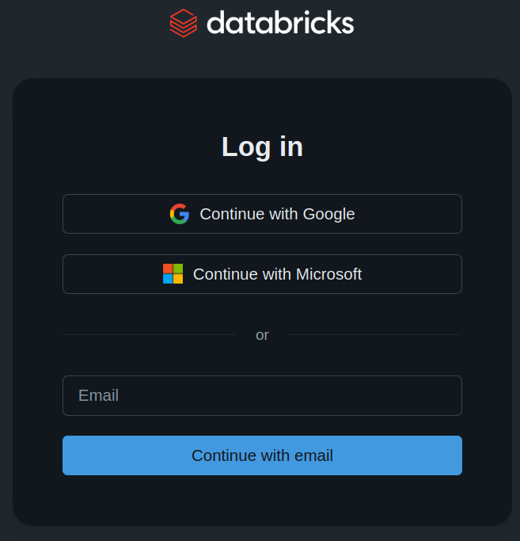

    Informe seu e-mail do **Insper**!

!!! exercise "Exercicio"
    Em seguida, você receberá um e-mail com o código de verificação.

    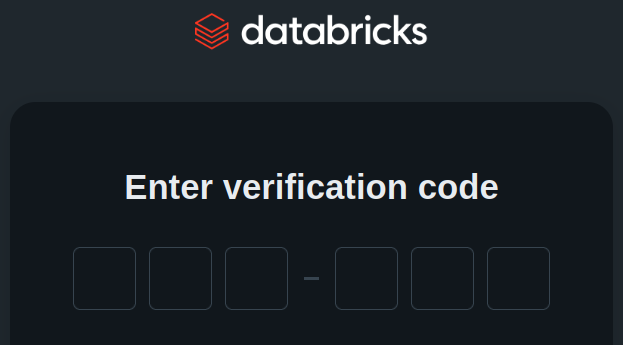

    Informe o código recebido para acessar o ambiente.

## Catalogo de Dados

Vamos explorar o catálogo de dados disponível no ambiente.

!!! exercise "Exercicio"
    Acesse o menu lateral esquerdo **Catalog** e selecione o catálogo **sfbikeshare**.

    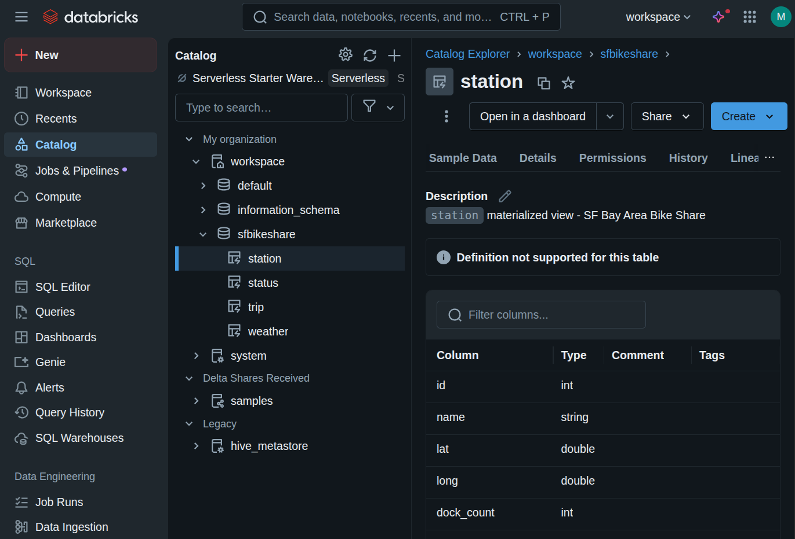

!!! exercise "Exercicio"
    Vá até a aba **Sample Data** para visualizar os dados de exemplo disponíveis.

    !!! info "Info"
        Caso receba a mensagem abaixo:

        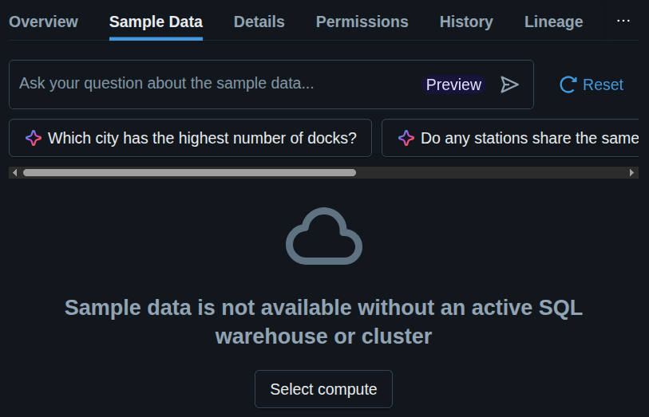

        Clique em **Select compute** e selecione o *cluster* já iniciado.

        

!!! exercise "Exercicio"
    Explore as tabelas disponíveis no catálogo.

## Computação

!!! exercise text long "Exercicio"
    Explore a opção **Compute** no menu lateral esquerdo.

    Quantos *clusters* estão ativos no ambiente?

    Liste também a configuração de um dos *clusters* (*active memory* e *active cores*).


!!! exercise text long "Exercicio"
    Qual o **Active DBU / h** do cluster? O que é **DBU / h**?

    !!! answer "Resposta"
        **DBU / h** significa **Databricks Unit por hora**. É uma unidade de medida que o **Databricks** utiliza para calcular o custo de uso da plataforma com base nos recursos computacionais consumidos.

        Cada tipo de instância (e por consequência, o *cluster*) tem um valor diferente de **DBU**, refletindo sua capacidade de **processamento** e **memória**.

        O custo total é calculado multiplicando o número de **DBUs** consumidos pelo tempo de uso em horas.

## Workspaces e Notebooks

!!! exercise "Exercicio"
    Acesse o menu lateral esquerdo **Workspaces**.

    Navegue até a pasta **Workspace > Users > seu_usuario**.

!!! exercise "Exercicio"
    Crie uma nova pasta chamada **aula_introdutoria**.

    !!! tip "Dica"
        Você pode fazer isto clicando com o botão direito ou pelo botão **Create** no canto superior direito.

!!! exercise "Exercicio"
    Acesse a pasta e crie um **notebook**.

!!! exercise text short "Exercicio"
    Clique na barra de título do notebook (onde está uma data) e renomeie para `introducao`.

    Na primeira célula, digite um código Python de `"Hello world"` e execute a célula.

    !!! tip "Dica"
        Para executar, basta clicar no botão de play ao lado da célula ou pressionar `Shift + Enter`.

    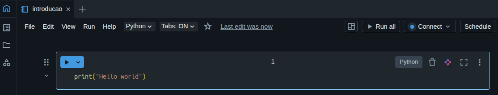

    O que aconteceu?

    !!! answer "Resposta"
        O **Databricks** solicita que você selecione um *cluster* para executar o código.

        Selecione o *cluster* já iniciado e clique em **Attach and run**.

### Executando SQL

!!! exercise text short "Exercicio"
    Crie uma nova célula de código no notebook.

    !!! tip "Dica"
        Clique no botão **+ Code** abaixo da célula atual.

    Altere o tipo da célula para **SQL**. Para isso, clique em **Python** no canto superior direito da célula e selecione **SQL**.

    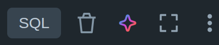

!!! exercise "Exercicio"
    Na célula **SQL**, digite o seguinte comando para listar os catálogos disponíveis:

    !!! warning "Atenção!"
        O comando **SQL** abaixo está incorreto de propósito! Execute-o mesmo assim.

    ```sql
    SHOW CATALOG;
    ```

    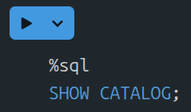

    Execute a célula.

    !!! answer "Resposta"
        Você verá que existe um erro na *query*.

        

        Se você clicar em **Diagnose**, o **Databricks** abre um chat com seu assistente de IA para ajudar a resolver o problema.

        Aceite a sugestão!

!!! exercise "Exercicio"
    No menu superior do notebook, altere a linguagem padrão do notebook para **SQL**, assim não precisaremos editar o tipo de célula toda vez.

!!! exercise "Exercicio"
    Crie uma célula e digite o seguinte comando para listar os esquemas disponíveis:

    ```sql
    SHOW SCHEMAS IN workspace;
    ```

!!! exercise "Exercicio"
    Crie uma célula e digite o seguinte comando para listar as tabelas disponíveis no esquema `sfbikeshare`:

    ```sql
    USE workspace.sfbikeshare;
    SHOW TABLES;
    ```

!!! exercise "Exercicio"
    Crie uma célula e digite o seguinte comando para listar parte dos dados da tabela `station`:

    ```sql
    SELECT *
    FROM station
    LIMIT 10;
    ```
!!! exercise text long "Exercicio"
    Crie uma célula e query para retornar as cinco estações com mais **docks** (coluna `dock_count`).

    !!! answer "Resposta"
        ```sql
        SELECT s.*
        FROM station AS s
        ORDER BY dock_count DESC
        LIMIT 5;
        ```

!!! exercise "Exercicio"
    Explore os dados das demais tabelas.

!!! exercise text short "Exercicio"
    Crie uma célula e digite o seguinte comando. O que esta query retorna?!

    ```sql
    SELECT s.id,
           s.dock_count,
           COUNT(*) AS qtde_trips
    FROM station AS s
    INNER JOIN trip AS t ON t.start_station_id = s.id
    GROUP BY s.id, s.dock_count
    ORDER BY qtde_trips DESC
    LIMIT 10;
    ```

    !!! answer "Resposta"
        A query retorna as 10 estações com mais viagens iniciadas (coluna `qtde_trips`), junto com o número de **docks** (coluna `dock_count`) de cada estação.

!!! exercise text long "Exercicio"
    Utilizando a mesma *query* da questão anterior, solicite ao assistente de IA do Databricks que converta a consulta para Python (usando PySpark).

    ```sql
    SELECT s.id,
           s.dock_count,
           COUNT(*) AS qtde_trips
    FROM station AS s
    INNER JOIN trip AS t ON t.start_station_id = s.id
    GROUP BY s.id, s.dock_count
    ORDER BY qtde_trips DESC
    LIMIT 10;
    ```

    Você prefere SQL ou Python?!

    !!! answer "Resposta"
        ```python
        %python
        from pyspark.sql import functions as F

        station_df = spark.table("station")
        trip_df = spark.table("trip")

        result_df = (
            station_df.join(
                trip_df,
                station_df.id == trip_df.start_station_id,
                "inner"
            )
            .groupBy(
                station_df.id,
                station_df.dock_count
            )
            .agg(
                F.count("*").alias("qtde_trips")
            )
            .orderBy(
                F.col("qtde_trips").desc()
            )
            .limit(10)
        )

        display(result_df)
        ```

## Compartilhando o Notebook

!!! exercise "Exercicio"
    No menu superior direito do notebook, clique em **Share**.

    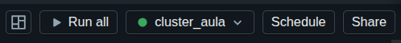

    Adicione o e-mail do seu colega de turma para compartilhar o notebook com ele.

    !!! info "Info"
        Garanta que o seu colega tem permissão de **Can Edit** para que ele possa executar o notebook.

        Confira se o seu colega consegue editar e executar códigos em seu notebook.

    Exemplo de compartilhamento com um grupo (permissão de visualização):

    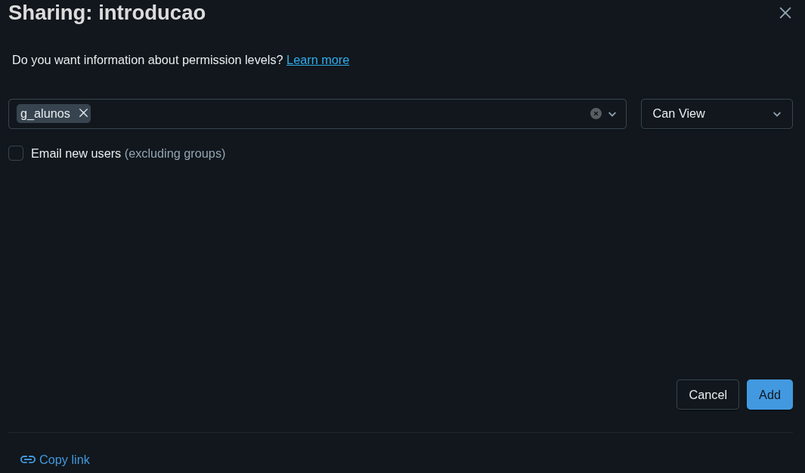

# Genie

O [**Genie**](https://docs.databricks.com/aws/en/genie/) é o assistente de IA do **Databricks** que permite interagir com seus dados utilizando linguagem natural.

!!! exercise text long "Exercicio"
    No menu lateral esquerdo, clique em **Genie**.

!!! exercise text long "Exercicio"
    Crie um novo **Space**.

    Durante a criação, selecione o catálogo `workspace` e todas as tabelas do esquema `workspace.sfbikeshare`.

    === "Parte 1"

        Clique em **All** e depois clique em **workspace**.
    
        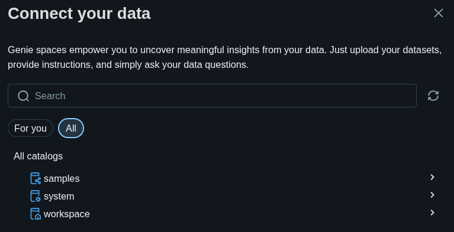

    === "Parte 2"

        Selecione o esquema `sfbikeshare` e clique em todas as tabelas.
    
        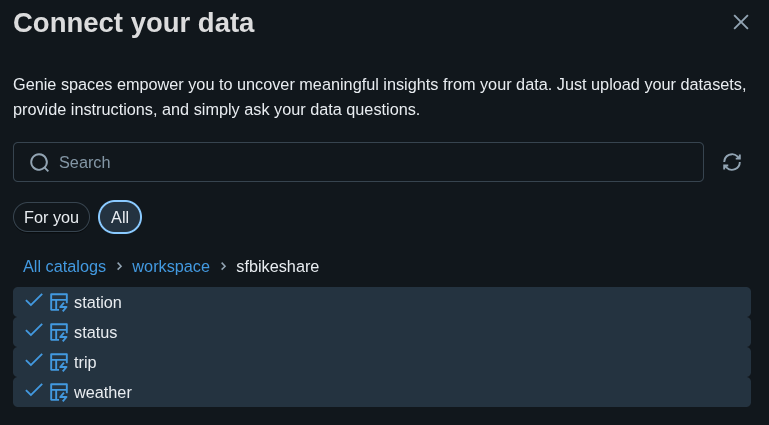

!!! exercise text long "Exercicio"
    Faça perguntas para o **Genie** sobre os dados disponíveis.

    Por exemplo:

    - *Quantas estações existem?*
    - *Qual é a distribuição de bicicletas disponíveis nas estações?*
    - *Crie um gráfico de linha com a média diária da disponibilidade de bicicletas por estação apenas para as estações 2, 3, 4, 5 e 6.*

    !!! tip "Dica"
        Utilize a opção **Show code** para ver a *query* SQL ou o código Python gerado pelo **Genie**.

        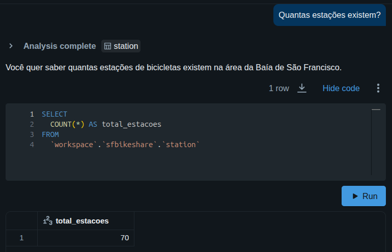

## Conclusão

O **Databricks** é uma plataforma poderosa que unifica diversas ferramentas e tecnologias para facilitar o trabalho com dados em larga escala.

Nesta primeira aula, você explorou o ambiente **Databricks**, aprendeu a criar e executar notebooks, e utilizou o assistente de IA **Genie** para interagir com os dados. Ou seja, uma visão de **Analista de Dados**.

Na próxima aula, você aprenderá como configurar seu próprio ambiente **Databricks** na **AWS** e explorará mais funcionalidades da plataforma, focando no papel de **Engenheiro de Dados**.
