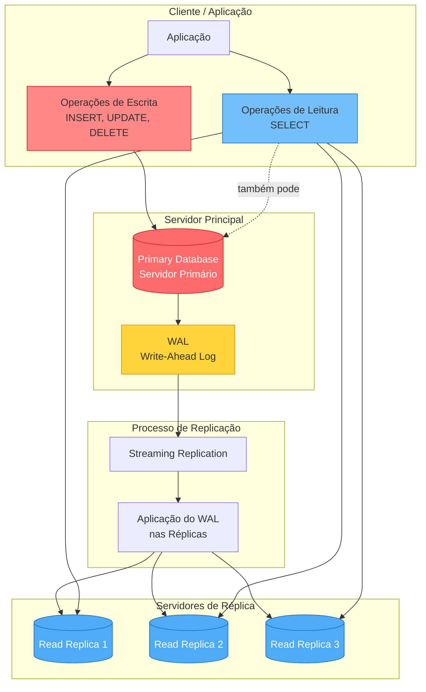

# Read Replica

Uma réplica de leitura (*read replica*) é uma cópia **somente leitura** de um banco de dados primário.

As réplicas de leitura são utilizadas principalmente paraÇ

- distribuir a carga de leitura,
- melhorar a disponibilidade e
- fornecer redundância.

Considere o diagrama na sequência, que ilustra o funcionamento da replicação e seu uso:



Os componentes principais são:

- **Primary Database**: servidor principal que recebe todas as operações de escrita. É a fonte única de verdade para os dados e o ponto central da arquitetura de replicação.
- **Read Replicas**: servidores secundários que recebem cópias dos dados do servidor primário. Podem ser múltiplas réplicas para distribuir a carga de leitura.
- **WAL (Write-Ahead Log)**: mecanismo de registro de transações do **PostgreSQL**. Todas as modificações são primeiro escritas no **WAL** antes de serem aplicadas aos dados, garantindo durabilidade e possibilitando a replicação.
- **Streaming Replication**: processo que transmite continuamente as mudanças do **WAL** do servidor primário para as réplicas em tempo real ou quase real.

!!! exercise text short "Exercício"
    As operações de **DML** (Data Manipulation Language) são tratadas de forma diferente entre o servidor primário e as réplicas de leitura.

    Explique como essas operações são gerenciadas em cada tipo de servidor.

    !!! answer "Resposta"
        Todas as operações de `INSERT`, `UPDATE` e `DELETE` devem ser direcionadas exclusivamente para o servidor primário.

        As réplicas **não aceitam escritas**, operando apenas em **modo de leitura**.

!!! exercise choice "Benefícios da IaC"
    Operações de leitura **SELECT** são executadas exclusivamente nas **read replicas**.

    - [ ] Verdadeiro
    - [X] Falso

    !!! answer "Resposta"
        Falso.
        
        Operações `SELECT` podem ser distribuídas entre as múltiplas réplicas, aliviando a carga do servidor primário.

        Mas as leituras também podem ser feitas no primário, se necessário.

## Benefícios da Arquitetura

A arquitetura de **read replicas** no **PostgreSQL** oferece **escalabilidade horizontal** ao distribuir a carga de leitura entre múltiplos servidores, o que aumenta a **disponibilidade** e garante maior **tolerância a falhas**.

Esta distribuição resulta em melhorias de **performance**, especialmente para aplicações com alto volume de consultas de leitura. Além disso, as réplicas podem estar em regiões geográficas diferentes (para reduzir a latência dos usuários) e também servem como recursos dedicados para operações de **backup** e execução de **queries analíticas** sem comprometer o desempenho do servidor primário.

## Prática

Vamos configurar uma réplica de leitura para um banco de dados **PostgreSQL**.

### Configurar Ambiente

Vamos configurar o ambiente necessário para a aula. Utilizaremos a mesma pasta da aula anterior.

!!! exercise "Exercício"
    Navegue até a pasta `15-query-opt` da aula anterior.
    
    Então, clone o repositório com os arquivos base para a aula:

    <div class="termy">

    ```
    $ cd 15-query-opt
    $ git clone https://github.com/macielcalebe/dataeng-query-opt-replica-base.git replica
    ```

    </div>

### Configurar Variáveis de Ambiente

Vamos configurar as variáveis de ambiente para o **PostgreSQL**.

!!! exercise "Exercício"
    Crie um arquivo `.env` a partir do arquivo `replica/.env.example` e altere as variáveis de ambiente.

    **OBS**: apenas as senhas são de alteração obrigatória.

### Iniciar Serviços

!!! exercise "Exercício"
    Inicie os serviços com o **Docker Compose**:

    !!! danger "Atenção!"
        Garanta que você está na pasta `15-query-opt/replica` antes de executar o comando abaixo.

    <div class="termy">

    ```
    $ docker compose up
    ```

    </div>

    !!! warning "Atenção!"
        Para maior velocidade, nesta aula, a tabela `status` será criada mas não será populada.

        Descomente o trecho no arquivo `replica/sql/003-load-status.sql` se quiser popular a tabela.
    
    Aguarde alguns segundos, você verá mensagens indicando que o **PostgreSQL** primário e a réplica estão operacionais.

    !!! danger "Windows"
        Se utilizar **Windows** e obter um erro `'required file not found'` no nó primário (`docker logs postgres-sfbikeshare-primary`), você precisará editar os arquivos `scripts/01-replication-setup.sh` e `scripts/02-replication-setup-replica.sh`, removendo os caracteres `\r` (*carriage return*) do final de cada linha.

        Para fazer isto:

        - Abra os dois arquivos de *script* no **VSCode**
        - Para cada arquivo, no canto inferior direito, clique em `CRLF` e selecione `LF`
        - Salve os arquivos e reinicie os serviços com o comando `docker compose down` seguido de `docker compose up`.

        !!! tip "CRLF vs LF"
            - `CRLF` (**Carriage Return + Line Feed**) é o formato de final de linha usado no Windows.
            - `LF` (**Line Feed**) é o formato de final de linha usado em sistemas Unix/Linux e é o esperado em scripts de shell.

## Conexão DBeaver

Vamos conectar ao banco de dados primário e à réplica utilizando o **DBeaver**.

!!! exercise "Exercício"
    No **DBeaver**, crie duas conexões separadas:
    
    !!! warning "Atenção!"
        Confira as variáveis de ambiente `POSTGRES_PORT_APP` e `POSTGRES_PORT_REPLICA` no arquivo `.env` para saber as portas corretas.

    1. Conexão para o banco de dados **primário** utilizando as credenciais do arquivo `.env`:
        - Host: `localhost`
        - Porta: `5434`
        - Usuário: conforme o arquivo `.env`
        - Senha: conforme o arquivo `.env`
        - Banco de dados: `sfbikeshare`

    1. Conexão para a **réplica de leitura** utilizando as credenciais do arquivo `.env`:
        - Host: `localhost`
        - Porta: `5435`
        - Usuário: conforme o arquivo `.env`
        - Senha: conforme o arquivo `.env`
        - Banco de dados: `sfbikeshare`

    Teste ambas as conexões para garantir que estão funcionando corretamente.

!!! exercise "Exercício"
    Em cada conexão, execute uma consulta qualquer para verificar se está tudo funcionando.

    É esperado que ambas as conexões retornem resultados idênticos, já que a réplica deve refletir o estado atual do banco primário.

    ```sql { .copy }
     SELECT COUNT(*)  AS qtde,
            MIN(t.start_date) AS first_start_date,
            MAX(t.start_date) AS last_start_date
    FROM trip t;
    ```

!!! exercise choice "Exercício"
    **Apenas na conexão com a réplica**, tente executar uma operação de `DELETE` em qualquer tabela.

    ```sql { .copy }
    DELETE FROM trip t
    WHERE t.id > 913000;
    ```

    Irá funcionar?

    - [ ] Sim
    - [X] Não

    !!! answer "Resposta"
        Não. A réplica de leitura é configurada para não aceitar operações de escrita, como `INSERT`, `UPDATE` ou `DELETE`.

!!! exercise "Exercício"
    Em cada conexão, execute a seguinte consulta e visualize o resultado:

    ```sql { .copy }
    SELECT *
    FROM trip
    ORDER BY id DESC;
    ```

    !!! info "Info"
        Observe que ambas as conexões retornam os mesmos dados, confirmando que a réplica está sincronizada com o primário.

        Estamos listando as últimas linhas inseridas na tabela `trip` para facilitar a visualização.

!!! exercise choices "Exercício"
    **Apenas na conexão primária**, tente executar a operação de `DELETE`:

    ```sql { .copy }
    DELETE FROM trip t
    WHERE t.id > 913000;
    ```

    !!! info "Info"
        A operação de `DELETE` deve ser bem-sucedida no banco primário, removendo as linhas especificadas.

        Estamos deletando todas as linhas com `id` maior que `913000` na tabela `trip`.

!!! exercise "Exercício"
    Em cada conexão, verifique as as linhas foram realmente deletadas.

    ```sql { .copy }
    SELECT *
    FROM trip
    ORDER BY id DESC;
    ```

    !!! info "Info"
        Observe que ambas as conexões retornam os mesmos dados, confirmando que a réplica está sincronizada com o primário.

!!! exercise "Exercício"
    Em cada conexão, execute a seguinte consulta para verificar o status da replicação:

    ```sql { .copy }
    SELECT
        pg_is_in_recovery() AS is_replica,
        now() - pg_last_xact_replay_timestamp() AS replication_lag;
    ```

    - No banco primário, `is_replica` deve retornar `false`.
    - Na réplica, `is_replica` deve retornar `true` e `replication_lag` deve ser um valor pequeno (ou zero), evidenciando que a réplica está atualizada.

    !!! info "Info"
        A função `pg_is_in_recovery()` indica se o servidor está operando como uma réplica (em recuperação).

        A função `pg_last_xact_replay_timestamp()` retorna o timestamp da última transação aplicada na réplica, permitindo medir o atraso na replicação.

## Uso prático

!!! exercise text long "Exercício"
    Considere um cenário onde uma aplicação web realiza muitas operações de leitura e escrita no banco de dados.

    Explique como a arquitetura de réplica de leitura pode beneficiar essa aplicação em termos de performance e escalabilidade.

    !!! answer "Resposta"
        A arquitetura de réplica de leitura pode beneficiar a aplicação web ao distribuir a carga de leitura entre múltiplas réplicas, aliviando o servidor primário que lida com as operações de escrita.

        Isso resulta em tempos de resposta mais rápidos para consultas `SELECT`, melhorando a experiência do usuário.

        Além disso, a escalabilidade horizontal permite adicionar mais réplicas conforme a demanda aumenta, garantindo que o sistema possa crescer sem comprometer a performance.

!!! exercise text long "Exercício"
    Mas como a aplicação sabe quando deve se conectar ao banco primário ou à réplica de leitura?

    !!! answer "Resposta"
        A aplicação deve ser configurada para direcionar as operações de escrita (`INSERT`, `UPDATE`, `DELETE`) para o banco primário, enquanto as operações de leitura (`SELECT`) podem ser distribuídas entre as réplicas de leitura.

        Isso pode ser feito através de um *load balancer* ou lógica na camada de aplicação que gerencia as conexões ao banco de dados.

        Algumas bibliotecas e frameworks oferecem suporte nativo para essa separação de leitura e escrita, facilitando a implementação dessa arquitetura.

        Pesquise por:
        
        - *read-write splitting*
        - **pgbouncer read write split**
        - **pgpool-ii read write split**

!!! tip "Dica"
    Leia esta página da documentação oficial para se aprofundar:

    - [PostgreSQL High Availability](https://www.postgresql.org/docs/current/high-availability.html)
    - [PostgreSQL warm standby](https://www.postgresql.org/docs/current/warm-standby.html)

## AWS RDS

A Amazon Web Services (AWS) oferece suporte a réplicas de leitura para bancos de dados **PostgreSQL** gerenciados através do serviço **Amazon RDS** (Relational Database Service).

Na plataforma, este processo de configuração é simplificado e já faz parte das opções disponíveis ao criar uma instância de banco de dados.

Por hoje é só!