# Framework

Na seção anterior, exploramos o que são entrevistas de *system design*, por que empresas as utilizam e quais habilidades elas avaliam. Vimos que essas entrevistas são vagas e abertas, simulando os desafios reais que engenheiros enfrentam no dia a dia.

No entanto, saber que a entrevista é aberta e sem resposta única pode ser intimidante. Como abordar um problema tão amplo em apenas 45 minutos ou uma hora? Por onde começar quando o entrevistador pergunta algo como *"Projete um sistema de recomendação de vídeos"* ou *"Desenhe a arquitetura de um data warehouse para análise de bilhões de eventos"*?

!!! info "Abordagem estruturada"
    Embora cada entrevista de *system design* seja única e não exista uma fórmula mágica, há uma estrutura que pode guiar sua abordagem e aumentar suas chances de sucesso.

Vamos explorar um *framework* eficaz para abordar entrevistas de *system design*, proposto por Alex Xu (livro *System Design Interview – An Insider's Guide*). Ele é composto por quatro etapas principais, cada uma com objetivos específicos e técnicas associadas.

## Etapa 1: Compreender o Problema e Estabelecer o Escopo

A primeira etapa de qualquer entrevista de *system design* é entender o problema que você está sendo solicitado a resolver. Parece óbvio, mas esta é a etapa onde muitos candidatos cometem erros.

Em uma entrevista de *system design*, responder rapidamente, sem entender **completamente** os requisitos, não só não traz pontos extras como é uma *red flag* para o entrevistador.

!!! warning "Fast and Furious"
    Lembre-se: a entrevista não é um concurso de respostas rápidas!
    
    Diminua o ritmo. Pense profundamente e faça perguntas para esclarecer requisitos e premissas.

Como engenheiros, tendemos a gostar de resolver problemas difíceis e pular direto para a solução final. Entretanto, essa abordagem frequentemente nos leva a projetar o sistema de forma inadequada. É preciso saber fazer as perguntas certas, estabelecer premissas adequadas e reunir informações adequadas antes de começar a construir.

!!! tip "Dica"
    Quando você faz uma pergunta durante a entrevista, o entrevistador pode responder diretamente ou pedir que você faça suas próprias suposições.

    Se ele pedir para você assumir algo, anote essas premissas no quadro branco ou no papel. Você pode precisar delas mais tarde, e demonstra organização e profissionalismo manter um registro claro das decisões tomadas.

### Quais perguntas fazer?

O objetivo nesta etapa é fazer perguntas que ajudem a esclarecer os requisitos exatos do sistema. Aqui estão alguns exemplos de perguntas relevantes que você pode fazer:

- **Sobre funcionalidades e escopo**: Quais recursos específicos vamos construir? Quais são as funcionalidades principais e quais são secundárias ou *nice-to-have*? Há alguma funcionalidade que está explicitamente fora do escopo desta discussão?

- **Sobre escala e performance**: Quantos usuários o produto tem atualmente? Qual é a taxa de crescimento esperada nos próximos 3 meses, 6 meses, um ano? Quantas requisições por segundo o sistema precisa suportar? Qual é a latência aceitável para as operações principais?

- **Sobre dados**: Qual é o volume de dados que precisamos processar? Os dados são estruturados, semi-estruturados ou não estruturados? Precisamos manter histórico de dados? Por quanto tempo?

- **Sobre restrições técnicas**: Qual é a *stack* tecnológica atual da empresa? Existem serviços ou ferramentas que já estão em uso e que podemos aproveitar para simplificar o design? Há restrições de orçamento, compliance ou regulatórias que precisamos considerar?

!!! example "Exemplo prático: Sistema de Recomendação de Séries"
    Imagine que você precisa projetar um sistema de recomendação de séries. A conversa entre você e o entrevistador pode seguir assim:
   
    **Candidato**: Quais são as funcionalidades principais da solução?
    
    **Entrevistador**: A capacidade de avaliar séries assistidas e receber recomendações personalizadas de novas séries.

    **Candidato**: Como os usuários interagem com o sistema?
    
    **Entrevistador**: Deve existir um aplicativo móvel Android.

    **Candidato**: IOS também? E web?
  
    **Entrevistador**: Por enquanto não.
    
    **Candidato**: As recomendações devem ser baseadas apenas no histórico do usuário ou também em tendências gerais? Por exemplo, devemos priorizar séries similares às que o usuário assistiu ou também incluir séries populares no momento?
    
    **Entrevistador**: Para manter as coisas simples, vamos focar em recomendações baseadas no histórico de avaliações do usuário e séries similares.
    
    **Candidato**: Quantas séries um usuário típico avalia?
    
    **Entrevistador**: Em média, 10 séries, mas pode variar de 5 a 200.
    
    **Candidato**: Qual é o volume de tráfego esperado?
    
    **Entrevistador**: 5 milhões de usuários ativos diariamente.
    
    **Candidato**: Precisamos considerar apenas séries ou também filmes e outros tipos de conteúdo?
    
    **Entrevistador**: Apenas séries por enquanto. Podemos expandir para outros tipos de conteúdo no futuro.

Observe como o candidato não assumiu nada e fez perguntas específicas para entender o escopo do sistema. Cada resposta ajuda a moldar o design que será proposto nas próximas etapas.

!!! exercise text long
    Suponha que você foi solicitado a projetar um *data warehouse* para análise de eventos de um aplicativo móvel. Liste pelo menos cinco perguntas que você faria ao entrevistador antes de começar a desenhar a arquitetura.

    !!! answer "Resposta sugerida"
        Algumas perguntas relevantes incluem:
        
        - Qual é o volume diário de eventos que precisamos processar?
        - Quais tipos de eventos estamos rastreando (cliques, visualizações, transações, etc.)?
        - Qual é a latência aceitável entre a ocorrência do evento e sua disponibilidade para análise?
        - Quem são os principais usuários do *data warehouse* (analistas, cientistas de dados, executivos)?
        - Existem requisitos de retenção de dados ou compliance que precisamos considerar?
        - Há sistemas ou ferramentas de BI que já estão em uso na empresa?

### Requisitos, restrições e gargalos

Nas entrevistas, o entendimento do problema pode ser expresso na definição dos **requisitos**, identificação de **restrições** e **gargalos**. Isso direciona a discussão e justifica as decisões de arquitetura.

Fazer as perguntas corretas irá ajudá-lo a identificar esses aspectos.

#### Requisitos do sistema

Provavelmente você já ouviu falar, em algum curso do Insper, sobre **requisitos funcionais** e **não-funcionais**:

- Os **requisitos funcionais** descrevem o que o sistema deve fazer. Para um sistema de *review* de séries, por exemplo, incluem funcionalidades como: usuários devem poder postar reviews, curtir séries, obter recomendações de séries semelhantes.

- Já os **requisitos não-funcionais** descrevem características de qualidade que o sistema deve ter, como escalabilidade, disponibilidade, consistência, latência e segurança. Estes requisitos frequentemente são mais críticos **para as decisões de arquitetura** do que os funcionais.

!!! exercise choice "Question"
    Qual dos seguintes é um requisito não-funcional para um sistema de processamento de dados em larga escala?

    - [ ] O sistema deve permitir que usuários façam upload de arquivos CSV.
    - [x] O sistema deve ser capaz de processar 1 milhão de registros por segundo.
    - [ ] O sistema deve fornecer uma interface web para visualização de dados.
    - [ ] O sistema deve permitir consultas SQL sobre os dados armazenados.

    !!! answer "Explicação"
        A capacidade de processar 1 milhão de registros por segundo é um requisito não-funcional relacionado à performance e escalabilidade do sistema. Os outros itens são requisitos funcionais que descrevem o que o sistema deve fazer.

Como as questões de *system design* são abertas, é importante fazer perguntas para esclarecer os requisitos.

Além disso, **não existe uma resposta única e correta**, existindo múltiplas abordagens válidas para resolver o mesmo problema, cada uma com seus próprios *trade-offs*.

!!! info "Exemplo"
    Considere a questão:

    !!! quote "Questão"
        *"Projete um sistema para processar a folha de pagamento de 150.000 funcionários no final de cada mês."*

    Você poderia focar em uma arquitetura baseada em **processamento em lote (*batch processing*)** usando uma solução como **Apache Spark** para processar todos os registros de forma massiva e agendada (**ETL**), otimizando para a **precisão**, a **consistência total** dos dados e o **custo-benefício**. Alternativamente, poderia propor um sistema **orientado a microsserviços e eventos**, onde as transações salariais são calculadas e enviadas ao banco de dados quase em tempo real, priorizando a atualização do dado em vez da eficiência de processar o volume total de uma só vez.

    Ambas as abordagens são válidas. A escolha entre elas depende dos requisitos específicos do sistema:

    - qual é o prazo final para o processamento?
    - A folha de pagamento exige uma única janela de cálculo consistente?
    - Qual é o nível de tolerância a erros e a complexidade regulatória?

!!! exercise text long
    Imagine que você está projetando um sistema de recomendação de produtos para um e-commerce. Liste pelo menos três perguntas que você faria ao entrevistador antes de começar a desenhar a arquitetura. Por que estas perguntas são importantes?

    !!! answer "Exemplo de resposta"
        Perguntas importantes incluem:
        
        1. **"Quantos usuários e produtos temos? Qual é a taxa de crescimento esperada?"**

            - Define requisitos de escala e influencia escolhas de tecnologia.

        1. **"Qual é a latência aceitável para as recomendações? Elas precisam ser em tempo real?"**

            - Determina se podemos usar processamento *batch* ou precisamos de *streaming*.

        1. **"Precisamos explicar as recomendações aos usuários?"**

            - Afeta a escolha de algoritmos e a complexidade do sistema de *logging* e rastreabilidade.

        Estas perguntas ajudam a transformar um problema vago em requisitos mais concretos que guiam as decisões de arquitetura.

#### Restrições do sistema

Restrições representam limitações dentro das quais a solução deve operar. Elas podem incluir orçamento disponível, tecnologias que a empresa já utiliza, expertise da equipe, requisitos regulatórios de conformidade, ou restrições de tempo para implementação.

!!! info "Exemplos"

    - Uma startup com equipe pequena restringe o projeto para que utilize serviços gerenciados (para reduzir *overhead* operacional), mesmo que isso signifique custos mais altos.
    - Uma fintech pode ter restrições regulatórias que exigem que dados sensíveis permaneçam em infraestrutura **on-premises**.

#### Identificação de gargalos

Gargalos podem surgir em diferentes pontos: banco de dados pode se tornar um gargalo de escrita quando o volume de transações cresce, a rede pode se tornar um gargalo ao transferir grandes volumes de dados entre componentes, ou o processamento pode se tornar um gargalo quando a complexidade das transformações aumenta.

Identificar esses gargalos antecipadamente permite propor soluções preventivas, como estratégias de *sharding* ou *read replicas* para distribuir carga de banco de dados, uso de *cache* para reduzir acessos repetitivos, ou implementação de processamento distribuído para paralelizar computações pesadas.

!!! warning "Otimização prematura"
    Embora seja importante identificar gargalos potenciais, cuidado com otimização prematura.

    Comece com uma arquitetura simples e clara, e adicione complexidade apenas quando os requisitos justificarem.

!!! exercise choice "Question"
    Você está projetando um sistema de processamento de eventos que receberá 10.000 eventos por segundo durante horário de pico. Qual das seguintes abordagens demonstra melhor compreensão de requisitos não-funcionais?

    - [ ] Implementar todas as funcionalidades possíveis para impressionar o entrevistador
    - [x] Perguntar sobre latência aceitável, requisitos de durabilidade dos dados e tolerância a falhas antes de propor uma arquitetura
    - [ ] Começar imediatamente a desenhar um diagrama detalhado sem fazer perguntas
    - [ ] Focar apenas em otimizar performance, ignorando outros aspectos

### Etapa 2: Propor um Design de Alto Nível e Obter Aprovação

Após entender claramente os requisitos e estabelecer o escopo do problema, a próxima etapa é desenvolver um *design* de alto nível e alcançar um acordo com o entrevistador sobre essa proposta inicial.

!!! warning "Atenção!"
    Esta etapa não é um monólogo onde você desenha um diagrama completo sozinho enquanto o entrevistador observa em silêncio.

Trate o entrevistador como um colega de equipe e tente colaborar com o entrevistador durante todo o processo.

Nesta etapa:

- **Desenhe um diagrama inicial**: Crie um esboço inicial do design usando diagramas de blocos no quadro branco ou papel. Este diagrama deve incluir os componentes principais do sistema, como clientes (*mobile/web*), APIs, servidores web, armazenamentos de dados, filas de mensagens e outros elementos relevantes.

!!! tip "Importante!"
    Mantenha o diagrama simples e focado nos componentes essenciais, sem se perder em detalhes de implementação neste momento.

- **Peça feedback continuamente**: Não espere terminar todo o diagrama para buscar a opinião do entrevistador. Conforme você desenha cada componente, pergunte se aquela abordagem faz sentido, se há algo que ele gostaria de discutir com mais profundidade, ou se há alguma restrição que você não considerou.

- **Faça cálculos aproximados**: Execute cálculos de *back-of-the-envelope* (estime) para avaliar se seu design inicial atende às restrições de escala. Por exemplo, se o sistema precisa suportar 10 milhões de usuários ativos diariamente, quantas requisições por segundo isso representa? Quanto armazenamento será necessário? Quantos servidores? Pense em voz alta durante esses cálculos e comunique-se com o entrevistador para confirmar se esse tipo de análise é necessário antes de se aprofundar.

- **Discuta casos de uso concretos**: Se possível, percorra alguns casos de uso específicos usando seu design. Por exemplo, *"Quando um usuário faz a avaliação de uma série, os dados fluem desta forma..."*. Essa abordagem ajuda a validar o *design* e ajuda a identificar *edge cases* que você ainda não havia considerado.

!!! info "Nível de detalhe"

    Uma dúvida comum nesta etapa é: devemos incluir *endpoints* de API e esquema de banco de dados?
    
    A resposta depende do problema específico e da direção que o entrevistador deseja seguir.

    Se você está projetando o sistema de recomendação do TikTok, entrar em detalhes de *endpoints* seria prematuro. Porém, caso você esteja projetando o **backend** de um sistema de reservas de voos, discutir **APIs** pode ser totalmente apropriado.

    !!! quote "Comunique-se com o entrevistador caso tenha dúvidas"
        Pergunte: *"Você gostaria que eu detalhasse os endpoints da API neste momento, ou posso continuar com a visão de alto nível?"*

Um exemplo de proposta inicial para um sistema de recomendação de séries pode ser o seguinte:

```mermaid
graph TB
    DNS["🌐 DNS"]
    User["User<br/>📱 Mobile app Android"]
    
    User --> DNS
    
    User -->|"v1/rate?<br/>series_id=123&rating=5<br/>auth_token=token"| LB["⚖️ Load Balancer"]
    
    LB --> WebServers["📦📦📦<br/>Web Servers"]
    
    WebServers --> RatingService["Rating Service"]
    WebServers --> RecommendationService["Recommendation Service"]
    WebServers --> UserService["User Service"]
    
    RatingService --> RatingDB[("🗄️🗄️🗄️<br/>Rating DB")]
    RecommendationService --> SeriesDB[("🗄️🗄️<br/>Series DB")]

    UserService --> UserDB[("🗄️<br/>User DB")]
    
    style WebServers fill:#90EE90,stroke:#333,stroke-width:3px,stroke-dasharray: 5 5
    style RatingDB fill:#ADD8E6,stroke:#1976D2,stroke-width:2px
    style SeriesDB fill:#ADD8E6,stroke:#1976D2,stroke-width:2px
    style UserDB fill:#ADD8E6,stroke:#1976D2,stroke-width:2px
```

??? tip "Load balancer"
    O **Load Balancer** distribui requisições dos usuários entre múltiplos servidores web, visando alta disponibilidade e escalabilidade.

    Este assunto é explorado na disciplina de **Computação em Nuvem**, obrigatória para Engenharia de Computação, mas você pode cursar como eletiva!

Esse diagrama apresenta os componentes principais sem entrar em detalhes de implementação.

O candidato pode então discutir com o entrevistador como cada componente funciona e validar se essa abordagem faz sentido antes de avançar.

!!! info "Colaboração é fundamental"
    Lembre-se: o objetivo desta etapa não é impressionar o entrevistador com um *design* perfeito e completo que você criou sozinho.

    O objetivo é demonstrar sua capacidade de colaborar, comunicar ideias técnicas claramente e incorporar feedback. Um design co-criado com o entrevistador é muito mais valioso do que um design individual.

### Etapa 3: Aprofundamento no Design

Neste ponto da entrevista, você e o entrevistador já devem ter alcançado os seguintes objetivos:

- Acordo sobre os objetivos gerais e escopo de funcionalidades
- Esboço de um design de alto nível para o sistema como um todo
- Recebimento de *feedback* do entrevistador sobre o *design* de alto nível
- Identificação inicial de áreas para aprofundar com base no *feedback* recebido

Agora é hora de trabalhar com o entrevistador para identificar e priorizar componentes específicos da arquitetura que merecem discussão mais detalhada.

!!! info "Info!"
    Cada entrevista é diferente, e a direção que esta etapa toma pode variar significativamente.

Algumas vezes, o entrevistador pode dar sinais de que prefere manter o foco em uma visão de alto nível de todos os componentes do sistema, sem se aprofundar muito em nenhum deles. Outras vezes, especialmente em entrevistas para posições *seniores*, a discussão pode se concentrar em características de performance do sistema, identificação de gargalos e estimativas de recursos necessários.

Na maioria dos casos, porém, o entrevistador desejará que você se aprofunde em detalhes de alguns componentes específicos do sistema. A escolha desses componentes depende do problema e das áreas de interesse do entrevistador.

!!! warning "Evite o excesso de detalhes"
    A capacidade de distinguir entre detalhes relevantes e irrelevantes é uma habilidade importante. Antes de se aprofundar em um tópico específico, pergunte-se: este detalhe demonstra minhas habilidades de design de sistemas? Ele é crítico para a escalabilidade ou confiabilidade do sistema? O entrevistador está interessado neste nível de profundidade?

!!! example "Versão aprofundada"
    Após discussão, estes foram os pontos levantados:

    - **Processamento Assíncrono** com **Message Queue**: Para evitar sobrecarga do sistema, o cálculo de recomendações foi desacoplado usando filas de mensagens, permitindo que *workers* dedicados processem as recomendações em paralelo sem impactar a experiência do usuário.
    - **Graph Database** para Relacionamentos Complexos: Adotado para modelar eficientemente as relações entre usuários, séries e avaliações, facilitando queries como "séries similares às bem avaliadas" e explorando grafos de usuários com gostos similares.
    - **Múltiplas Camadas de Cache Especializadas**: Implementação de **caches** separados (Rating, User, Recommendation) para otimizar diferentes padrões de acesso, reduzindo latência e permitindo que recomendações pré-computadas fiquem disponíveis instantaneamente.
    - **Recommendation Workers Escaláveis**: *Cluster* independente de *workers* que processa *jobs* da fila, permitindo escalabilidade horizontal baseada na demanda e isolamento de falhas (problemas nos workers não afetam outras funcionalidades).
    - **Trade-off Fan-out vs Pull Model**: Optou-se por um modelo híbrido (computar sob demanda + cache) em vez de pré-computar para todos os 5M de usuários ativos, balanceando custo de processamento com complexidade e priorizando disponibilidade sobre consistência imediata.

Diagrama da versão aprofundada do sistema de recomendação de séries:

```mermaid
graph TB
    DNS["🌐 DNS"]
    User["User<br/>📱 Mobile app Android"]
    
    User --> DNS
    
    User -->|"v1/rate?<br/>series_id=123&rating=5<br/>auth_token=token"| LB["⚖️ Load Balancer"]
    
    LB --> WebServers["📦📦📦<br/>Web Servers<br/><br/>Authentication<br/>Rate Limiting"]
    
    WebServers --> RatingService["Rating Service"]
    WebServers --> UserService["User Service"]

    UserService --> UserCache
    
    RatingService --> RatingCache[("💾💾💾<br/>Rating Cache")]
    
    RatingCache --> RatingDB[("🗄️🗄️🗄️<br/>Rating DB")]
    
    WebServers --> RecommendationService["Recommendation Service"]
    
    RecommendationService -->|"① get user ratings"| GraphDB[("🕸️<br/>Graph DB")]
    
    RecommendationService -->|"③"| MessageQueue["✉️✉️✉️<br/>Message Queue"]
    
    RecommendationService -->|"② get similar series"| UserCache[("💾💾💾<br/>User Cache")]
    
    UserCache --> UserDB[("🗄️🗄️🗄️<br/>User DB")]
    
    MessageQueue -->|"④"| RecommendationWorkers["📦📦📦<br/>Recommendation Workers"]
    
    RecommendationWorkers -->|"⑤"| RecommendationCache[("💾💾💾<br/>Recommendation Cache")]
    
    style WebServers fill:#90EE90,stroke:#333,stroke-width:3px,stroke-dasharray: 5 5
    style RecommendationWorkers fill:#90EE90,stroke:#333,stroke-width:3px,stroke-dasharray: 5 5
    style RatingCache fill:#ADD8E6,stroke:#1976D2,stroke-width:2px
    style RecommendationCache fill:#ADD8E6,stroke:#1976D2,stroke-width:2px
    style RatingDB fill:#ADD8E6,stroke:#1976D2,stroke-width:2px
    style UserDB fill:#ADD8E6,stroke:#1976D2,stroke-width:2px
    style UserCache fill:#ADD8E6,stroke:#1976D2,stroke-width:2px
    style GraphDB fill:#ADD8E6,stroke:#1976D2,stroke-width:2px
```

!!! exercise text long
    Você está projetando um *data warehouse* para uma empresa de e-commerce e já apresentou o design de alto nível.

    O entrevistador pede para você se aprofundar em como você lidaria com a ingestão de dados de múltiplas fontes (banco de dados transacional, *logs* de aplicação, dados de terceiros).

    Que aspectos você abordaria nesta discussão?

    !!! answer "Resposta sugerida"
        Aspectos relevantes incluem:
        
        - Escolha entre **ETL** e **ELT** e justificativa
        - Estratégias de *Change Data Capture* (CDC) para capturar mudanças no banco transacional
        - Uso de filas de mensagens ou *streaming* para *logs* de aplicação
        - APIs ou conectores para dados de terceiros
        - Orquestração de pipelines e tratamento de dependências
        - Monitoramento e tratamento de erros
        - Estratégias de *retry* e garantias de consistência

### Etapa 4: Encerramento

Na etapa final da entrevista, o entrevistador pode dar liberdade para discutir pontos adicionais. Esta é sua última oportunidade de causar uma impressão positiva e demonstrar pensamento crítico sobre o *design* proposto.

Aproveite para explorar:

- **Identificação de gargalos**: O entrevistador pode querer que você identifique possíveis gargalos no sistema e discuta melhorias potenciais. Nunca diga que seu design é perfeito e que nada pode ser melhorado.

Por exemplo, você pode mencionar que o *cache* poderia ser melhorado com uma estratégia de invalidação mais sofisticada, ou que a estratégia de particionamento de dados poderia ser otimizada conforme o sistema escala.

- **Recapitulação do design**: Pode ser útil dar ao entrevistador uma recapitulação breve do seu design. Isso é particularmente importante se você sugeriu algumas soluções diferentes ao longo da entrevista.

!!! info "Info!"
    Uma recapitulação eficaz destaca as decisões principais da arquitetura, os *trade-offs* considerados e como o *design* atende aos requisitos estabelecidos no início.

- **Casos de erro e resiliência**: Casos de erro são tópicos interessantes para discutir:

    - Como o sistema lida com falhas de servidor?
    - E se houver perda de conexão de rede?
    - O que acontece se um componente crítico falhar?
    - Discutir estratégias como *circuit breakers*, *fallback* para modos degradados, e replicação de dados demonstra maturidade no design de sistemas distribuídos.

- **Questões operacionais**: Aspectos operacionais valem a pena mencionar.

    - Como você monitora métricas e *logs* de erro?
    - Como você implanta (*rollout*) o sistema de forma segura?
    - Há estratégias de *blue-green deployment* ou *canary releases*?
    - Como você realiza *backups* e garante a recuperação de desastres?
    
!!! info "Info!"
    Essas discussões mostram que você pensa além do design inicial e considera o ciclo de vida completo do sistema.

- **Próximas curvas de escala**: Como lidar com a próxima curva de crescimento é outro tópico interessante.

Por exemplo, se seu design atual suporta 1 milhão de usuários, quais mudanças você precisaria fazer para suportar 10 milhões de usuários? Ou 100 milhões?

!!! info "Info!"
    Esta discussão demonstra compreensão de como sistemas evoluem e escalam ao longo do tempo.

- **Refinamentos adicionais**: Proponha outros refinamentos que você faria se tivesse mais tempo.

Por exemplo, você poderia implementar **machine learning** para personalização, adicionar suporte a múltiplas regiões geográficas para reduzir latência, ou integrar com ferramentas de observabilidade mais avançadas.

!!! exercise text long
    Você projetou um pipeline de processamento de dados em *streaming* para análise de eventos de **IoT**.

    O entrevistador pergunta: *"Como você lidaria com o cenário onde o volume de eventos aumenta subitamente de 10 mil eventos por segundo para 100 mil eventos por segundo?"*

    Como você responderia?

    !!! answer "Resposta sugerida"
        Possíveis abordagens incluem:
        
        - Uso de *auto-scaling* para componentes de processamento
        - Filas de mensagens (*RabbitMQ* ou *Kafka*) para absorver picos e desacoplar produtores de consumidores
        - Estratégias de *backpressure* para evitar sobrecarga
        - *Caching* agressivo de resultados intermediários
        - Processamento em janelas temporais maiores durante picos, com refinamento posterior
        - Monitoramento de métricas críticas (*lag* de fila, latência, taxa de erro) para detectar problemas rapidamente

## Evitar e Fazer

Vamos resumir as principais práticas recomendadas e armadilhas a evitar durante uma entrevista de *system design*.

=== "Práticas Recomendadas"

    - **Sempre peça esclarecimentos**: Nunca assuma que suas premissas estão corretas. Fazer perguntas demonstra maturidade e profissionalismo. É muito melhor pedir esclarecimento do que construir o sistema errado baseado em premissas incorretas.

    - **Compreenda os requisitos do problema**: Certifique-se de entender completamente o que está sendo pedido antes de começar a desenhar. Um entendimento sólido dos requisitos é a base de um bom design.

    - **Não há resposta certa ou melhor resposta**: Uma solução projetada para resolver os problemas de uma startup jovem é diferente daquela de uma empresa estabelecida com milhões de usuários. Certifique-se de entender os requisitos e o contexto.

    - **Comunique o que você está pensando**: Deixe o entrevistador saber o que passa pela sua cabeça. Comunique-se continuamente durante toda a entrevista. O processo de pensamento é tão importante quanto o resultado final.

    - **Sugira múltiplas abordagens quando possível**: Demonstrar que você considera alternativas e avalia *trade-offs* é uma habilidade valiosa. Por exemplo, você pode dizer: *"Podemos usar uma abordagem A, que oferece melhor performance mas é mais complexa, ou uma abordagem B, que é mais simples mas pode ter limitações de escala."*

    - **Priorize componentes críticos**: Uma vez que você e o entrevistador concordem com o design geral, entre em detalhes sobre cada componente, começando pelos mais críticos. Não gaste tempo em componentes menos importantes.

    - **Trate o entrevistador como um colega**: Um bom entrevistador trabalha com você como um membro da equipe. Use isso a seu favor. Peça *feedback* e faça perguntas!

    - **Nunca desista**: Mesmo se você ficar preso em algum ponto, continue tentando. Mostre sua capacidade de perseverar e encontrar soluções.

=== "Armadilhas a Evitar"

    - **Não fique despreparado para perguntas típicas**: Existem padrões comuns em entrevistas de *system design*. Estude problemas clássicos (design de URL shortener, sistema de cache distribuído, feed de notícias, etc.) e entenda os padrões comuns de arquitetura.

    - **Não pule para uma solução sem esclarecer requisitos**: Este é provavelmente o erro mais comum e mais grave. Resistir à tentação de começar a desenhar imediatamente é fundamental para o sucesso.

    - **Não entre em muitos detalhes de um único componente logo no início**: Forneça primeiro o design de alto nível e depois aprofunde progressivamente. Uma abordagem incremental é muito mais eficaz do que tentar resolver tudo de uma vez.

    - **Não hesite em pedir dicas se ficar preso**: Se você não souber como prosseguir, não fique em silêncio tentando descobrir sozinho. Peça orientação ao entrevistador. Isso demonstra humildade e capacidade de buscar ajuda quando necessário.

    - **Não pense em silêncio**: Comunique-se constantemente. O entrevistador precisa entender seu processo de pensamento. Mesmo se você estiver considerando diferentes opções, verbalize isso: *"Estou pensando se devemos usar uma arquitetura baseada em eventos ou uma abordagem mais tradicional de request-response..."*

    - **A entrevista não termina quando você apresenta o design**: Você não terminou até que o entrevistador diga que terminou. Continue engajado, peça feedback frequentemente e esteja preparado para discutir melhorias, trade-offs e questões adicionais.

!!! exercise choice "Question"
    Durante uma entrevista de *system design*, você percebe que cometeu um erro no design de alto nível que apresentou.

    O que você deve fazer?

    - [ ] Ignorar o erro e continuar, esperando que o entrevistador não perceba
    - [ ] Mudar de assunto rapidamente para evitar discussão sobre o erro
    - [x] Reconhecer o erro, explicar por que ele aconteceu e propor uma correção
    - [ ] Defender o design incorreto para não parecer inseguro

    !!! answer "Explicação"
        Reconhecer erros e corrigi-los demonstra maturidade profissional e capacidade de aprender com feedback.

        Entrevistadores valorizam candidatos que podem admitir quando estão errados e ajustar sua abordagem.

## Distribuição de Tempo

Como as questões de *system design* geralmente são amplas, e 45 minutos ou uma hora não é suficiente para cobrir todos os aspectos do sistema em profundidade, é importante saber como distribuir seu tempo entre as diferentes etapas.

Para uma entrevista típica de 45 minutos, uma distribuição aproximada de tempo seria:

- **Etapa 1 - Compreender o problema e estabelecer o escopo**: 3 a 10 minutos

Esta etapa é fundamental e não deve ser apressada, mas também não deve consumir tempo excessivo. O objetivo é fazer as perguntas certas e estabelecer um entendimento claro dos requisitos, não explorar cada detalhe possível do problema.

- **Etapa 2 - Propor design de alto nível e obter aprovação**: 10 a 15 minutos

Esta é geralmente a etapa mais importante em termos de tempo investido. Você precisa de tempo suficiente para desenhar os componentes principais, explicá-los claramente, e obter feedback do entrevistador.

- **Etapa 3 - Aprofundamento no design**: 10 a 25 minutos

Esta é a etapa mais flexível em termos de tempo. Dependendo da complexidade do problema e das áreas de interesse do entrevistador, você pode passar mais ou menos tempo aqui. Em alguns casos, pode ser apropriado gastar 25 minutos discutindo detalhes específicos da arquitetura. Em outros, 10 minutos podem ser suficientes.

- **Etapa 4 - Encerramento**: 3 a 5 minutos

Reserve alguns minutos no final para recapitular, discutir melhorias e responder perguntas finais. Não deixe que o tempo acabe abruptamente sem um fechamento apropriado.

!!! warning "Distribuição flexível"
    Esta é uma estimativa muito aproximada, e a distribuição real de tempo depende do escopo do problema e dos requisitos do entrevistador.

!!! info "Sinais do entrevistador"
    Preste atenção aos sinais que o entrevistador dá sobre o que ele considera importante.

    Se ele fizer muitas perguntas sobre **escalabilidade** durante o design de alto nível, provavelmente quer que você se aprofunde nesse aspecto na etapa 3.

    Se ele parecer satisfeito com a visão geral e começar a fazer perguntas sobre casos específicos de uso, siga essa direção.

!!! exercise text long
    Reflita sobre como você normalmente gerencia seu tempo ao resolver problemas complexos. Você tende a gastar muito tempo planejando ou prefere começar a implementar rapidamente? Como isso se relaciona com a distribuição de tempo sugerida para entrevistas de *system design*?

    !!! answer "Reflexão"
        Pessoas diferentes têm estilos diferentes. Alguns preferem planejar extensivamente antes de começar, enquanto outros gostam de iterar rapidamente.

        Nas entrevistas *system design*, procure buscar um equilíbrio.
